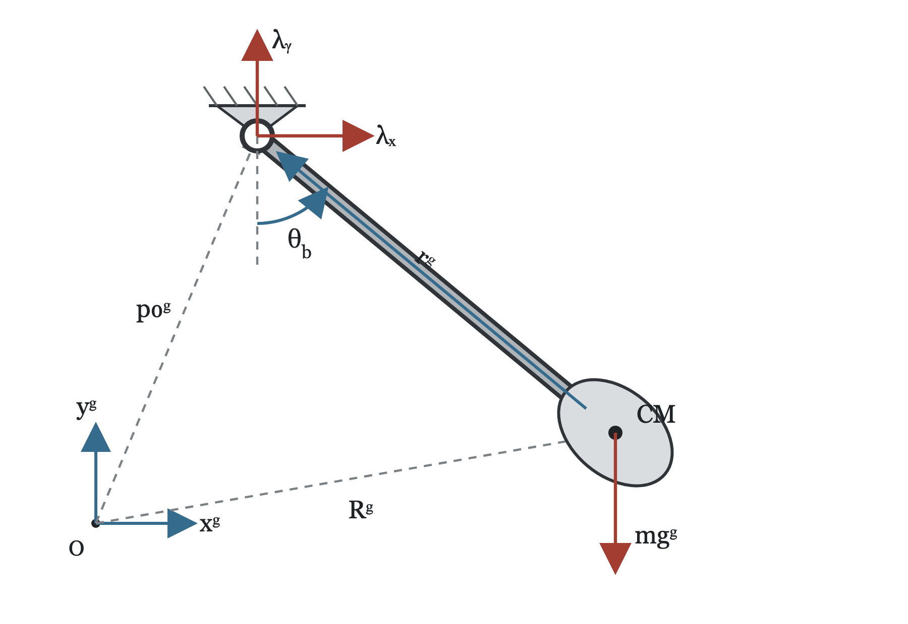
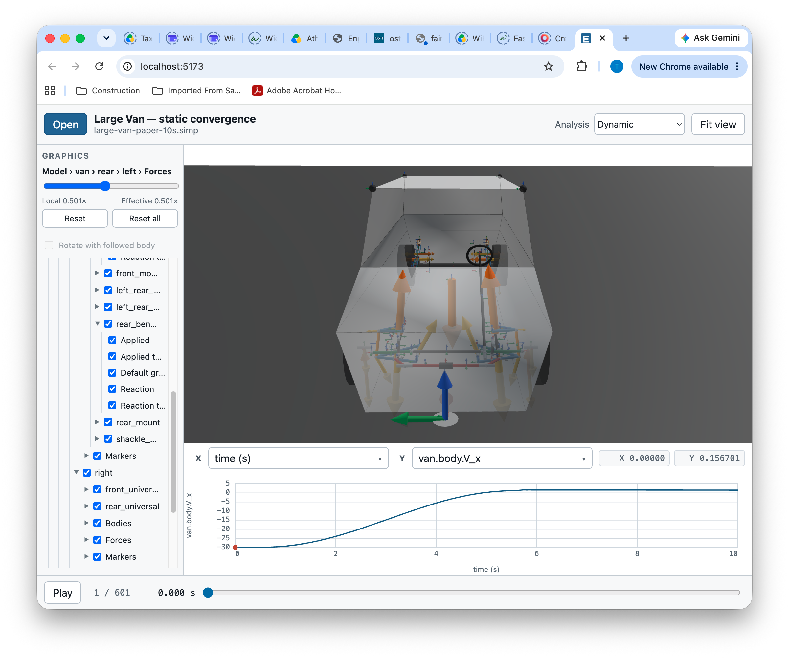

# Sparse Fully Consistent Modeling Method

Thomas Wielenga

Wielenga Innovation Foundation, Inc.

4218 N Surf Rd, Hollywood, FL  33019

thomas@wielenga.org

ASME Member:  20001319227

## ABSTRACT

This paper presents the Sparse Fully Consistent Modeling Method, in which all
variables satisfy all levels of the constraint equations (displacement,
velocity and acceleration) at all times. The equations are formulated in
implicit form and integrated by a stiff (BDF) integrator. The equations are
produced component by component, are relatively simple, and allow the
formulation of the partial derivatives needed for a Jacobian in simple terms.
Assembly of these partials into a Jacobian produces a large but very sparse
Jacobian which can be solved efficiently. Comparisons are made to other
existing methods and model formulations. Planar examples and benchmarks are
examined, and the results show that the large unreduced system can be solved
efficiently. Both a working 2D mechanism simulation program and a 3D mechanism
simulation program are freely available for close inspection and reuse. They
include an extensive set of modeling elements and methods for calculating
consistent initial conditions, static equilibrium, and modal analysis. In
addition, a graphical interface allows animation and plotting of system
variables, and Lua and Julia modeling interfaces allow the building of complex
hierarchical models.


## 1. INTRODUCTION

Real mechanical systems often contain stiff bushings, dampers, contact forces,
flexible parts, and driveline components. These components introduce high
frequencies that can decay rapidly. A "non-stiff" integrator must take steps
small enough for the highest frequency or fastest mode, even after its motion
has decayed. A stiff integrator can take much larger steps (orders of magnitude
larger), but it requires a Newton-like correction and an efficient solution of
a matrix of partial derivatives (a Jacobian). Therefore, for efficiency reasons, a 
practical general mechanism
simulation program requires the use of a stiff integrator
[@wielenga_effect_1986; @hairer_solving_1996].

Many integrators require the user to solve explicitly for the derivative of the state
variables. Other integrators instead formulate the
equations in implicit form. These implicit integrators can even solve equations that include
algebraic relationships. These kinds of equations are called
differential-algebraic equations (DAEs)
[@petzold_description_1983; @brenan_numerical_1996].

Some modeling methods reduce the system to a smaller set of coordinates and
then solve for the highest derivatives in order to use an explicit integrator.
Some methods use relative coordinates to represent the degrees of freedom
[@wittenburg_dynamics_1977]. Another method partitioned the Cartesian
coordinates into a set of dependent and independent coordinates and then 
transformed the equations into a reduced set and solved for the independent coordinates [@wehage_generalized_1982; @haug_state-space-based_1997].
This produces fewer equations, but solving them requires a factorization of a
complicated mass matrix. If the system is stiff, a Jacobian is required and
this process produces an inordinately complicated Jacobian. Using differencing to calculate the Jacobian can become expensive as the system grows. Jacobian-free
methods can avoid forming the entire Jacobian, but they may require a
preconditioning matrix that is still difficult to create.

Because stiff elements are prevalent in mechanical systems, a stiff 
implicit DAE solver is the method of choice for practical
simulation programs and has been used for many years in the popular 
ADAMS simulation program
[@orlandea_sparsity-oriented_1977; @orlandea_sparsity-oriented_1977-1;
@orlandea_study_1999; @noauthor_adams_2021]. There are many choices as to which equations
and variables to use in a stiff implicit formulation. We will explore 
some of these choices
and compare their advantages and disadvantages. We will present the Sparse
Fully Consistent Modeling Method. It keeps the component equations in 
implicit form, and each component produces a small number of variables,
equations, and Jacobian partials. These contributions are assembled into a
large sparse system. The sparse matrix solver finds an efficient order for
solving for the variables, eliminating any need for special solution paths for
open chains, tree topologies, or closed loops.

Fully Consistent means the position, velocity, and acceleration constraint
equations are present and satisfied during the entire solution process, not
just at output times. The method keeps all the physical variables, including
forces, accelerations, velocities, and positions, in the solution set and adds
differential equations only for the states needed to represent the degrees of
freedom. This produces a solvable set of equations at each solution step.


## 2. EQUATION FORMULATIONS

Throughout the paper, $q$, $v$, and $a$ denote collections of position,
velocity, and acceleration variables; $\lambda$ denotes constraint reactions;
$\Phi$ denotes position constraints; and $D$ is the velocity-constraint partial
matrix. Superscripts $g$ and $b$ identify components resolved in the global and
body frames. Subscripts $i$ and $j$ identify the first and second markers or
bodies in a component. A hat denotes a unit vector, the superscript $T$ denotes
a transpose, and an overdot denotes differentiation with respect to time.
Symbols used only for a particular component or derivation are defined where
they appear.

To illustrate the different variable and equation choices, we will use the planar pendulum. The pendulum has mass and rotational inertia and is acted on by gravity. It is attached to ground by a revolute joint that allows only rotation about its pivot.

{width=60%}

**Figure 1. Planar pendulum under gravity**


There are variables for the position of the mass, its velocity, and its acceleration. There is an angle, an angular velocity, and an angular acceleration. Finally, the revolute joint may define a relative angle and its derivatives. Because there is a constraint, there are also constraint forces that enforce the constraint.


**Table 1. Candidate variables for the planar pendulum**

| Variable | Symbol |Count |
|---|---|---:|
| Center-of-mass position| $R^g=[R_x\;\;R_y]^T$ | 2 |
|  Translational velocity| $V^g=[V_x\;\;V_y]^T$ | 2 |
|  Translational acceleration| $a^g=[a_x\;\;a_y]^T$ | 2 |
|  Body angle, velocity, acceleration | $\theta_b$, $\omega_b$, $\alpha_b$  | 3 |
|  Pin angle, velocity, acceleration| $\theta_p$, $\omega_p$, $\alpha_p$|3| 
|  Pin reaction| $\lambda^g=[\lambda_x\;\;\lambda_y]^T$ | 2 | 
| **Total variables** | | **14** |


**Table 2.  Candidate equations**

| Kind | Equation block | Count |
|---|---|---:|
|  Force balance| $m a^g-\lambda^g-mg^g=0$ | 2 |
|  Moment balance| $J\alpha-(d^g)^T\lambda^g=0$ | 1 |
|  Acceleration pin constraint| $a^g+d^g\alpha-r^g\omega^2=0$ | 2 |
|  Velocity pin constraint| $V^g+d^g\omega=0$ | 2 |
|  Position pin constraint| $R^g+r^g-p_0^g=0$ | 2 |
|   **Total equations**  || **9** |

### Constraints

An ideal position constraint is written

$$
\Phi(q,t)=0.
$$

The velocity and acceleration constraint equations are obtained by
differentiating the position constraint:

$$
\dot\Phi=D(q,t)v+\phi(q,t)=0,
$$

$$
\ddot\Phi=D(q,t)a+\gamma(q,v,t)=0.
$$

### Constraint deficit

Differential-algebraic equations can be categorized by their index. This is the
number of differentiations of the equations needed to solve for derivatives of
all the variables. Since the desired formulation includes constraint forces,
a typical mechanical system would require
three differentiations of the position constraints to solve for the derivatives
of the constraint forces.  However, there is no need to know the derivatives of 
constraint forces in mechanical systems.  The constraint forces themselves
can be solved directly with just two derivatives of the position constraints. 
This leads us to introduce the "Constraint Deficit."

Constraint Deficit is the number of additional differentiations needed before
the accelerations and reactions can be solved. A formulation using only the
position constraint has Deficit Two. A velocity formulation has Deficit One,
and the acceleration formulation has Deficit Zero. This definition is based on
the mechanical quantities of interest. Constraint Deficit gives the
analyst a direct description of how many constraint differentiations would be needed
to obtain accelerations and reactions.  The higher the deficit, the more the
integrator has to provide derivatives numerically
[@brenan_numerical_1996; @ilchmann_dae_2017; @otter_transformation_2017].  

Implicit integrators estimate derivatives by fitting polynomials through present and past
values. This allows them to solve problems that would otherwise be difficult to solve.
But estimating derivatives numerically can produce widely divergent results.
The BDF method used here estimates derivatives from its history polynomial. 
A first derivative contains coefficients proportional to $1/h$, so 
at small step sizes small errors get magnified and the derivative estimates can
become erratic.  A derivative of a derivative would contain coefficients proportional to $1/h^2$, 
so a second derivative becomes even more erratic and compounds error.


We will use our simple pendulum to compare the performance of some established
formulations and some new ones. Classical approaches to constraint enforcement
are reviewed in [@laulusa_review_2008].

The different formulations have different deficits and characteristics, as
summarized in Table 3.

**Table 3. Constraint deficit and constraint-level behavior of the formulations**

| Formulation | Deficit | Positions | Velocities | Accelerations/Forces |
|---|---:|---|---|---|
|Position constrained | 2 | constrained | 1 deriv | 2 derivs |
|Velocity constrained | 1 | adrift | constrained | 1 deriv |
|Acceleration constrained | 0 | adrift | adrift | constrained |
|Baumgarte stabilization | 0 | stiff | stiff | stiff |
|GearStableV | 1 | constrained | constrained | 1 deriv |
|GearStableA | 0 | constrained | constrained | constrained |
|Fully Consistent | 0 | constrained | constrained | constrained |

Here "constrained" means the values are subject to a constraint. 
"adrift" means that the values may drift apart after some integration time.
"1 deriv" and "2 deriv" refer to the number of numerical derivatives needed to 
accurately solve for accelerations and forces.
"stiff" means that stiffness is introduced to reduce error over time. 

The early ADAMS formulation retained $\Phi=0$. It was sparse and prevented
position drift, but its Deficit Two required two numerical differentiations to
obtain acceleration and reaction information, producing velocity errors and
erratic behavior at small step sizes [@orlandea_study_1999;
@noauthor_adams_2021]. Retaining $\dot\Phi=0$ instead gives consistent joint
velocities and Deficit One, but allows position drift. Retaining only
$\ddot\Phi=0$ makes accelerations and reactions directly solvable with Deficit
Zero, but permits both position and velocity drift.

### Baumgarte stabilization
In this formulation, all three constraints are involved in the solution. A
linear combination of the derivatives of the constraints is constrained to zero: 
$\ddot \Phi + 2 \zeta \omega_n \dot \Phi + \omega_n^2 \Phi = 0$
[@baumgarte_stabilization_1972]. This does not
ensure that any of the constraints will be satisfied exactly. However, the
constants $\zeta$ and $\omega_n$ are chosen to
drive the position error in the joint toward zero.  Faster response produces stiffer 
equations but loosens the constraint on accelerations.  The numerical stiffness 
may be a problem for a non-stiff integrator, but not for a stiff integrator. The damping $\zeta$ 
may be chosen to remain in the stability regions of BDF integrators.

### Stabilized velocities (GearStableV)
GearStableV retains the position constraints ($\Phi = 0$) and adds the velocity constraints:
$\dot \Phi = 0$ [@gear_automatic_1985].  The velocity equations serve to minimize 
the difference between the velocity variables calculated numerically and
those that satisfy the velocity constraint.  To do this it adds a second
set of multipliers. Appendix A derives this minimization.

### Stabilized velocities and accelerations (GearStableA)
GearStableA goes one step further and also adds the acceleration constraint 
equations and uses an additional set of satisfaction multipliers. These
methods keep the indicated constraint levels satisfied, but allow small
differences between some physical variables and their time derivatives.

### Fully consistent
The Fully Consistent method incorporates all three levels of the constraint
equations: $\ddot \Phi = 0$, $\dot \Phi = 0$, and $\Phi = 0$. It adds
positions, velocities, and accelerations as explicit variables in the solution set.
To get a solvable system it adds a minimal set of differential equations that
span the degrees of freedom of the mechanism.
It is accurate in positions, velocities and accelerations. 
See below for its development. 

## 3. Experimental examination of the formulations

The planar pendulum formulations were implemented with the same mechanical
properties and compared with an independent reduced-coordinate solution.  The
purpose of these experiments was not to find the fastest formulation.  It was
to determine how the choice of constraint equations affects position,
velocity, acceleration, reaction, and energy errors.

### Position, velocity, and acceleration constraints

The position-, velocity-, and acceleration-constrained formulations use the
same eight solution variables:

$$
y=
\begin{bmatrix}
R_x&R_y&\theta&V_x&V_y&\omega&\lambda_x&\lambda_y
\end{bmatrix}^{T}.
$$

The position and velocity variables are differential variables.  The reaction
variables are algebraic, but their accepted values are retained in the BDF
history and predicted before the next correction.  Each formulation retains
only one level of the pin constraint.

All three cases started from the same consistent initial condition and ran for
five seconds with relative tolerance $10^{-5}$ and absolute tolerance
$10^{-7}$.  Table 4 compares the calculated motion with the reduced-coordinate
solution. Tables 4--6 were regenerated for version 0.2.0 in the isolated
paper-verification environment recorded in `paper/evidence/0.2.0`.

**Table 4. Order of error in single-level constraint formulations**

The constraint-error column lists
$(\lVert\Phi\rVert_\infty,\lVert\dot\Phi\rVert_\infty,
\lVert\ddot\Phi\rVert_\infty)$; the difference column lists
$(\Delta q,\Delta\lambda,\Delta\mathcal E)$; and $N_s$ is the number of
accepted integration steps.

| Method | Level | Constraint errors | Differences | $N_s$ |
|---|---|:---|:---|---:|
| Position |$\Phi=0$| $(10^{-12},10^{-4},10^{-2})$ | $(10^{-4},10^{-2},10^{-4})$ | 209 |
| Velocity | $\dot \Phi=0$ | $(10^{-5},10^{-9},10^{-3})$ | $(10^{-4},10^{-3},10^{-4})$ | 222|
| Acceleration | $\ddot \Phi=0$ | $(10^{-4},10^{-4},10^{-8})$ | $(10^{-4},10^{-4},10^{-3})$ | 223|

Each formulation satisfies the constraint level that it enforces.  The
position-constrained formulation holds $\Phi=0$ to the nonlinear solution
tolerance, but it has the largest acceleration and reaction differences. The
velocity formulation holds $\dot\Phi=0$ to the nonlinear solution tolerance,
while its position drifts and its acceleration and reaction errors lie between
the other two cases.
The acceleration formulation gives the best acceleration and reaction values,
but allows both position and velocity constraint errors to accumulate.
Its deviation from conservation of energy is also highest.

These results show that satisfying one constraint level very accurately does
not ensure the same accuracy at the other levels.  They also show the practical
meaning of Constraint Deficit.  As the deficit increases, the force balance
depends on acceleration estimates produced through more numerical
differentiation.  The resulting reaction differences increase by roughly two
orders of magnitude from Deficit Zero to Deficit Two in this experiment.

The step counts should not be interpreted as a general performance ranking.
The formulations control different quantities, and the position-constrained
case does not control velocity error.  The important result is the movement of
error from the imposed constraint level into the levels obtained by numerical
differentiation.

### Baumgarte stabilization

The Baumgarte experiment used a different initial condition.  A position
constraint error of $10^{-3}$ was deliberately introduced while the initial
velocity constraint error was zero.  Critical damping was used, so

$$
\ddot\Phi+2\omega_n\dot\Phi+\omega_n^2\Phi=0,
$$

with correction time

$$
\tau=\frac{1}{\omega_n}.
$$

Relative and absolute tolerances were both $10^{-5}$.  The experiment varied
the correction time to determine whether the calculated constraint error
followed the intended critically damped decay.

**Table 5. Baumgarte correction of an imposed position error**

Max crit is the maximum absolute difference between the calculated position
constraint error and its intended critically damped decay.

| $\tau$ (s) | Max crit | Final $\lVert\Phi\rVert_\infty$ | Final $\lVert\dot\Phi\rVert_\infty$ | Final $\lVert\ddot\Phi\rVert_\infty$ | Steps |
|---:|---:|---:|---:|---:|---:|
| 0.20 | $1.1\times10^{-4}$ | $2.0\times10^{-5}$ | $1.7\times10^{-4}$ | $1.8\times10^{-3}$ | 146 |
| 0.10 | $8.1\times10^{-5}$ | $2.2\times10^{-5}$ | $2.0\times10^{-4}$ | $2.6\times10^{-3}$ | 146 |
| 0.05 | $6.8\times10^{-5}$ | $1.3\times10^{-5}$ | $2.2\times10^{-4}$ | $3.5\times10^{-3}$ | 145 |

All three runs reached BDF order five and closely followed the intended
critical decay (Max crit).  Baumgarte stabilization therefore restored
an existing position error without separately imposing the position and
velocity constraints. However, constraint errors generally increased by an order of magnitude
from position to velocity to acceleration.  A shorter correction time 
did not necessarily decrease
the position error but did increase the acceleration error. The shorter
correction time increased numerical stiffness but did not result in
the stiff integrator needing more steps.

### Gear stabilization and the Fully Consistent method

The GearStableV formulation retains both $\Phi=0$ and $\dot\Phi=0$.  It uses a
constraint-satisfaction multiplier in the differential relationship between
position and velocity.  GearStableA also retains $\ddot\Phi=0$ and adds a
second multiplier in the relationship between velocity and acceleration.  In
this way all of the selected constraint levels can be satisfied, while small
differences are allowed between adjacent derivative levels.

The Fully Consistent formulation closes the enlarged system differently.  It
retains all three constraint levels, but supplies differential equations only
for the independent angular velocity and angle.  The other positions,
velocities, and accelerations remain explicit variables and are solved as part
of the complete implicit system.

Table 6 compares both Gear formulations and the Fully Consistent formulation.
The same reduced-coordinate trajectory provides the reference.

**Table 6a. Constraint errors in the multiple-level formulations**

| Method | Levels | $\lVert\Phi\rVert_\infty$ | $\lVert\dot\Phi\rVert_\infty$ | $\lVert\ddot\Phi\rVert_\infty$ |
|---|:---|---:|---:|---:|
| GearStableV | $\Phi$, $\dot\Phi$ | $4.2\times10^{-12}$ | $4.7\times10^{-10}$ | $2.3\times10^{-3}$ |
| GearStableA | $\Phi$, $\dot\Phi$, $\ddot\Phi$  | $5.5\times10^{-12}$ | $4.4\times10^{-10}$ | $4.3\times10^{-8}$ |
| Fully Consistent | $\Phi$, $\dot\Phi$, $\ddot\Phi$ | $1.7\times10^{-11}$ | $4.4\times10^{-10}$ | $5.0\times10^{-8}$ |

**Table 6b. Solution differences and computational size**

$N_s$ is the number of accepted steps, $N_y$ is the number of simultaneous
variables, and $N_c$ is the number of error-controlled variables.

| Method | $\Delta q$ | $\Delta\lambda$ | $\Delta\mathcal E$ | $N_s$ | $N_y$ | $N_c$ |
|---|---:|---:|---:|---:|---:|---:|
| GearStableV | $5.4\times10^{-4}$ | $2.3\times10^{-3}$ | $1.5\times10^{-4}$ | 222 | 13 | 6 |
| GearStableA | $2.5\times10^{-4}$ | $7.5\times10^{-4}$ | $9.6\times10^{-5}$ | 222 | 15 | 6 |
| Fully Consistent | $1.5\times10^{-4}$ | $5.8\times10^{-4}$ | $7.5\times10^{-5}$ | 178 | 11 | 2 |

GearStableV satisfied the position and velocity constraints as expected.
Its acceleration satisfaction is relatively poor. GearStableA adds that constraint and
reduces the acceleration differences.  

The Fully Consistent formulation satisfies all three levels of the constraints.
It also has the smallest state, reaction, and energy differences,
although only marginally.
It had fewer simultaneous variables than either
GearStable formulation and only two error-controlled variables.
It also needed fewer steps.

The experiments lead to three conclusions.  First, enforcing a constraint
level makes that level accurate but does not make its numerical
derivatives accurate.  Second, stabilization can reduce position errors,
but higher derivatives have larger errors.  Third, all constraint levels
can be retained without integrating every physical coordinate.  The Fully
Consistent method uses a minimal set of physical state equations while solving
the remaining physical variables and constraint equations together.


## 4. Fully Consistent equations

The Fully Consistent method solves in terms of physical variables that are useful to
the modeler.  They can be grouped as

$$
x=(q,v,a,\lambda,\xi),
$$

where $q$, $v$, and $a$ are positions, velocities, and accelerations,
$\lambda$ contains ideal-constraint reactions, and $\xi$ contains other
component variables.  The variables in $\xi$ may define geometry, force,
deformation, slip, or an internal constitutive state. 

The complete implicit system can be divided into model equations
and selected state equations:

$$
F(t,x,\dot x)=
\begin{bmatrix}
\mathcal M(t,x, \dot x)\\
\mathcal S(x,\dot x)
\end{bmatrix}
=0.
$$

The model equations $\mathcal M$ contain the force and moment balances, all
active levels of the ideal constraints, orientation equations, and the local
geometry, force, and constitutive equations. They may also contain internal
differential equations for such things as friction and tire deformation.

The selected-state equations $\mathcal S$ are simple first-order differential equations.
The variables are selected from candidate physical state variables. 
If velocity $v_k$ and its corresponding coordinate $q_k$ are
selected, the two equations have the form

$$
a_k-\dot v_k=0, \qquad
v_k-\dot q_k=0.
$$

In spatial mechanisms, each rigid body (except ground) contributes six degrees of freedom. Each independent constraint equation removes one of them. The number of mechanical degrees of freedom in a spatial mechanism without redundant constraints is
$$
N_{dofs} = 6 \times N_{bodies} - N_{constraints}
$$

Here $N_{bodies}$ counts the moving bodies and excludes ground, while
$N_{constraints}$ counts independent scalar constraints.

One pair of variables is selected for each mechanical degree of freedom. 
(See Section 5 for how this is done.) 
The other physical positions, velocities, and accelerations remain in $x$, 
but they do not receive selected-state equations. There is one velocity variable
and its corresponding displacement-level variable in each pair representing a freedom.

### The BDF integrator

A Backward Differentiation Formula (BDF) integrator estimates the derivative of 
a variable by approximating it as the derivative of a polynomial passing through 
values of the variable. It can use a different number of past values in its
approximation. At order five, the polynomial uses the current value and up to
five previous values, or six points in total.
The current derivative depends on the current value as well as
past values.  This allows it to be more stable than many other integrators, but
it also means a derivative cannot be calculated ahead of time and 
then used to find a solution. It means that the current value must be solved simultaneously 
with the other variables in the solution set
[@petzold_description_1983; @brenan_numerical_1996; @hairer_solving_1996]. 
For a particular step, after the order, step size, and history have been set, a
BDF formula reduces to a linear relationship: 

$$
\dot v_{i+1} = (\beta/h) v_{i+1} + \alpha_{i}.
$$

The coefficient $\beta$ depends on the order and, for variable steps, the recent
step-size history. The current step size is $h$, and $\alpha_i$ is the contribution
from past values. By its operation, a BDF integrator essentially substitutes the
BDF formula for every variable in the solution set that is defined as a derivative.
The BDF integrator keeps track of past values and can predict 
(using the fitted polynomial) the next value by extrapolation.  Then it corrects the solution
using the current BDF formulas and a Newton-type iteration.  This requires a Jacobian 
matrix of partial derivatives.

The BDF formulas, combined with the selection set equations,
relate the freedom positions to the freedom velocities and the 
freedom velocities to the selected accelerations. Thus all freedom variables are related to
past values by the BDF formulas.  The constraints and force balance equations then 
provide the remaining relationships needed to make the entire set solvable as a
set of simultaneous equations.
The solution found must satisfy the BDF formulas and the model equations.
The BDF integrator looks at the solution found and estimates the error
and either accepts the step or tries to find a more accurate solution by changing
the step size or order of the polynomial.

In the solution method, every model variable is predicted and corrected, even those not in the freedom set,
and every variable's value is retained in the BDF history.
In addition, the freedom states contribute differential equations to the
equation set and participate in the default error control.
Some components also have internal states and contribute differential equations
that are integrated and may be included in error control.

### Component equations and reactions

Each body, joint, force, and auxiliary element contributes its own variables
and equations.  It also contributes the partial derivatives of those
equations with respect to the variables it uses to a system Jacobian.  The global equation vector
and system Jacobian are assembled by mapping these small local contributions into
global rows and columns. This produces a large but very sparse Jacobian matrix. This sparsity-oriented component assembly has a long
history in multibody simulation
[@orlandea_sparsity-oriented_1977; @orlandea_sparsity-oriented_1977-1].

Constraints contribute constraint equations ($\Phi$) and constraint forces ($\lambda$).  The velocity equation for an ideal constraint can be written

$$
\dot\Phi=Dv+\phi=0.
$$

The same matrix $D$ that maps body velocities into constraint velocity maps a
constraint reaction back into the body force and moment balances.  With the
sign convention used here, its generalized force is

$$
Q_c=D^T\lambda.
$$

This follows directly from virtual power:

$$
\lambda^T D\,\delta v=(D^T\lambda)^T\delta v.
$$

The reaction therefore remains a local variable of the joint, while its
effects on the connected bodies are assembled automatically. 

Most components involve only one or two bodies and a small number of local
variables.  Their Jacobian contributions are consequently small.  The
assembled system is large because it contains all the physical variables and equations, but it
is sparse because the components have limited connections to other components.
Modern sparse matrix factorization methods can efficiently factor the Jacobian
and allow the equations to be solved rapidly by Newton iteration. Smooth
steps usually require only a small number of Newton corrections.

### Component Jacobians and automatic differentiation

The program uses both analytical partial derivatives and automatic
differentiation. Simple equations are usually clearer and less expensive when
their partials are written directly. These include the body balances,
kinematic state equations, many joint primitives, and the mappings that apply
forces and reactions to bodies. Automatic differentiation is used where a
correct analytical expansion would be long or difficult to maintain
[@revels_forward-mode_2016].

Automatic differentiation is applied at the component level. Let $z$ be
the small subset of model variables used by a component, and let its equations
be

$$
r(t,z,\dot z)=0.
$$

The component first identifies the global columns belonging to $z$. The
automatic differentiator then evaluates the ordinary component code using
dual numbers for only those variables in $z$.  Each identified variable in $z$
($z_i$) is represented by a dual number with a unique infinitesimal $\epsilon_i$:

$$
\widetilde z_i=z_i+\epsilon_i.
$$

The ordinary part is the variable's current value. The coefficient of
$\epsilon_i$ is initially one because a variable's partial derivative with
respect to itself is one. Its partial derivative with respect to every other
variable is zero. Products of infinitesimals are defined to be zero for all
$i$ and $j$:

$$
\epsilon_i\epsilon_j=0.
$$

Evaluation of the component equations using dual number arithmetic then gives

$$
r_i(t,\widetilde z,\dot z)
=r_i(t,z,\dot z)
+\sum_{k=1}^{p}
\left(\frac{\partial r_i}{\partial z_k}\right)\epsilon_k.
$$

Here, $p$ is the number of local variables. The coefficient of each unique
$\epsilon_k$ in the calculated equation is therefore the partial derivative
of that equation with respect to $z_k$. Reading these coefficients from every
component equation forms the local Jacobian. When there are more local
variables than available dual-number slots, the variables are evaluated in
several chunks, with each variable in a chunk assigned a unique slot.

After the BDF formula is substituted for the derivatives, 
the component contribution to the Newton matrix is

$$
J_c=
\frac{\partial r}{\partial z}
+\frac{\beta}{h}
\frac{\partial r}{\partial \dot z}.
$$

The derivatives with respect to $z$ may be analytical, automatically
differentiated, or a combination of the two. The usually simple derivative
terms involving $\dot z$ are added directly. The resulting block is placed
in the component's previously allocated global rows and columns. Automatic
differentiation therefore supplies numerical coefficients; it does not
discover the model connectivity or turn the complete Jacobian into a dense
matrix.

Automatic differentiation is used for user-defined force and torque expressions, and it
is nested to obtain the velocity and acceleration of a user-defined motion
expression. It is also used for selected local calculations in contact,
friction, cam, belt, gear, tire, and flexible-marker elements. At a piecewise
force transition, it differentiates the branch that is currently active. A zero
partial from an inactive force does not alter the sparsity pattern.

### Fully Consistent pendulum

The pendulum is a good example.  The complete set of model variables contains accelerations, velocities, displacements and reaction forces.  The model variable vector has eleven variables:
$$
x=
\begin{bmatrix}
a_x&a_y&\alpha&V_x&V_y&\omega&R_x&R_y&\theta&\lambda_x&\lambda_y
\end{bmatrix}^{T}.
$$

The model equations contain force balance equations, a torque balance equation, acceleration constraints, 
velocity constraints, and position constraints:

$$
\mathcal M(t,x)=
\begin{bmatrix}
m a^g-\lambda^g-mg^g\\
J\alpha-(d^g)^T\lambda^g\\
a^g+d^g\alpha-r^g\omega^2\\
V^g+d^g\omega\\
R^g+r^g-p_0^g
\end{bmatrix}
=0.
$$

where 
$$
r^g=A^{gb}(\theta)r_m^b,
\qquad
d^g=A^{gb}(\theta)S r_m^b,
\qquad
S=\begin{bmatrix}0&-1\\1&0\end{bmatrix}.
$$

Thus $S r_m^b$ is $r_m^b$ rotated counterclockwise by $90^\circ$.

The first two equations are the body force and moment balances.  The next three
are the acceleration, velocity, and position levels of the pin constraints.
The total number of equations is: $ 2+1+2+2+2=9 $.

The planar pendulum has one degree of freedom (3 body freedoms minus 2 constraints) and it is natural to select the body's angular
velocity $\omega$ as a state variable along with its position partner $\theta$. 
The derivative of $\omega$ is angular acceleration and the derivative of $\theta$ is 
$\omega$.  The state selection (freedom) equations are:

$$
\mathcal S(x, \dot x)=
\begin{bmatrix}
\alpha-\dot\omega\\
\omega-\dot\theta
\end{bmatrix}
=0.
$$

These two equations bring the number of equations up to eleven which matches the number
of variables and makes the entire system solvable.

> **Note.** The pin angle and its derivatives listed in Table 1 are candidate
> relative coordinates. To use them, we would add three defining equations and
> three variables. They are unnecessary here because the body’s angular
> velocity can serve and a relative coordinate is unneeded.

Table 7 shows the variables on which each equation block depends, including
dependence through $r^g(\theta)$, $d^g(\theta)$, or a BDF derivative.

**Table 7. Equation and variable structure of the Fully Consistent pendulum**

| Equations | Count | Variables used |
|---|---:|:---|
| Force balance | 2 | $a^g,\lambda^g$ |
| Moment balance | 1 | $\alpha,\theta,\lambda^g$ |
| Acceleration constraint | 2 | $a^g,\alpha,\omega,\theta$ |
| Velocity constraint | 2 | $V^g,\omega,\theta$ |
| Position constraint | 2 | $R^g,\theta$ |
| $\alpha-\dot\omega=0$ | 1 | $\alpha,\omega$ |
| $\omega-\dot\theta=0$ | 1 | $\omega,\theta$ |
| **Total** | **11** |  |

There are three position-level variables: $R_x$, $R_y$, and $\theta$, and
two position-level constraints. The BDF relation for $\theta$ supplies the
third position-level equation. Similarly, the BDF relation for $\omega$
supplies one velocity-level equation, while the two velocity constraints
supply the other two. The acceleration constraints and the force and moment
balances provide the equations for the accelerations and reaction forces.
The values of all these
quantities are determined simultaneously in one large but very sparse system by Newton
iteration.

The pendulum therefore has eleven variables and eleven
equations, but only $\omega$ and $\theta$ are differential and
error-controlled variables.  Acceleration is an explicit unknown rather
than the numerical derivative of a velocity as is typically done.  All
three constraint levels (position, velocity, and acceleration) are present
in the equation set and are satisfied to the solution tolerance.

In general, the BDF Newton matrix is

$$
J_F=F_x+c_jF_{\dot x},
$$

where $c_j=\beta/h$ is the leading derivative coefficient of the current BDF formula.
In terms of the model and the selected states this is:

$$
J_F=
\begin{bmatrix}
\mathcal M_x + c_j \mathcal M_{\dot x}\\
\mathcal S_x + c_j \mathcal S_{\dot x}
\end{bmatrix}
$$

For the planar pendulum $\mathcal M_{\dot x}=0$. In a general model it can be
nonzero because spatial orientation equations and component internal states may
contain derivatives. If the selected variables are ordered as
$(a_s,v_s,q_s)$, then
$$
\mathcal S_x+c_j\mathcal S_{\dot x}
=
\begin{bmatrix}
I&-c_jI&0\\
0&I&-c_jI
\end{bmatrix}.
$$

## 5. Preparing the equations for solution

The initial configuration of a model, as specified by the user, may not satisfy the constraints.  
The program therefore corrects the entered initial conditions before it decides whether any constraints are redundant and which physical variables will be states.

### Correcting the initial conditions

The entered body positions and orientations are estimates. Let $C_0(q,t_0)=0$
contain the active position-level equations at the initial time. These include
the ideal position constraints, relative-coordinate relations, and
motion-generator equations. At each correction iteration the
program solves the weighted minimum-motion problem

$$
\min_{\Delta q}\frac{1}{2}\Delta q^T W_q\Delta q
$$

subject to the linearized equations

$$
C_{0,q}\Delta q=-C_0(q,t_0).
$$

The corrected value is used to form a new linearization, and the process is
repeated until the position equations are satisfied. This does not choose a
reduced set of coordinates. It only moves the entered model to a consistent
configuration. Consistent initialization is itself a general problem for DAE
systems [@pantelides_consistent_1988].

The weights determine how an otherwise ambiguous correction is distributed.
For a body of mass $m_b$ and characteristic length $L_b$, the default
translational weight is proportional to $m_b$, and the rotational weight is
proportional to $m_bL_b^2$. Thus a massive body normally moves less than a
light body. The rotational weight is an inertia-like scalar used for the
correction; it is not the body's inertia tensor. A user scale can increase or
decrease both weights. A small positive numerical weight is used for a
zero-mass body.

In a planar model, the rotational correction is a change in body angle. In a
spatial model, it is a small body-fixed rotation applied to the orientation;
the four Euler parameters are not corrected as four independent coordinates.
An initial value can be "imposed" in the data set.  If so, its value is omitted from the available correction variables.
If the remaining variables cannot satisfy the equations, initialization stops
and the problem is reported.

After consistent positions are found, velocities are corrected in the same way.
At the consistent configuration,
the velocity equations can be written

$$
C_1(q,v,t_0)=D(q,t_0)v+\phi(q,t_0)=0,
$$

where

$$
D=\frac{\partial C_1}{\partial v}.
$$

The program finds a weighted minimum change $\Delta v$ satisfying

$$
D\Delta v=-C_1(q,v,t_0).
$$

This problem is linear in velocities and requires only one iteration.  Positions and velocities are therefore consistent before state selection.
This order is important. A constraint matrix evaluated at an inconsistent
configuration can have a different rank or can suggest a state choice that is
poor at the assembled configuration.

### Freedom determination

The columns of $D$ correspond to individual physical velocity candidates.
They may be body translations, body angular velocities, or optional relative
joint and distance velocities. Translational and angular columns have
different units and normally have different numerical magnitudes. The program
therefore forms

$$
\overline D=S_rDS_c.
$$

For each body, its translational columns are multiplied by a characteristic
length, while its angular columns have a scale of one. The characteristic
length is normally the greatest distance from the body center of mass to one
of its markers. After column scaling, every nonzero row is normalized. This
keeps the numerical rank and pivot choices from being determined mainly by
units or body size.

A column-pivoted QR factorization gives

$$
\overline D P_c=QR.
$$

Let $n$ be the number of velocity candidates and let $r$ be the numerical
rank. The first $r$ pivot columns identify a nonsingular dependent set. The
remaining

$$
f=n-r
$$

columns are independent (free) velocity candidates. The number $f$ is the mechanical
degree of freedom of the assembled model after accounting for freedoms removed
by motion generators. Background on coordinate partitioning methods may be found at
[@wehage_generalized_1982; @haug_implicit_1992; @haug_state-space-based_1997].

The independent columns define the selected velocity states. A selected translational velocity is paired with the corresponding
body position. A selected angular velocity is paired with a planar angle or a
body-fixed pseudo angle. An optional relative joint or distance velocity is
paired with its corresponding relative coordinate. The two selected-state
equations described in Section 4 are activated for each pair.

The automatic pivot order is a numerical choice and is not always the most
useful mechanical choice. The analyst may prefer a crank angular velocity, a
joint-relative rate, or another coordinate that remains understandable
throughout the motion. A preferred choice is accepted only if its
complementary dependent block has rank $r$ and an acceptable condition number.
Otherwise the program can reject the model or fall back to the automatic
choice. This check prevents a preference from making the complete implicit
system singular at its initial configuration.


### Redundant constraint removal

A QR factorization of the transpose of a submatrix of $\overline D$ can be used to determine redundant constraints. Let $\overline D_d$ contain the $r$ dependent columns found above.

The factorization

$$
\overline D_d^T P_r=Q_rR_r
$$

selects $r$ independent rows. The remaining rows are redundant. A constraint 
identified by a redundant row is deactivated. Its complete family is
deactivated: the position, velocity, and acceleration equations and the
corresponding reaction variable. 

This operation does not assert that the removed physical constraint is absent.
It says that its equation is already enforced by the retained constraints.
The associated reaction is set to zero, but the distribution of forces between
it and the active constraints is indeterminate.
The program records the inactive family so the analyst
can see which reaction has been removed.

State selection and redundant-row selection are related, but they are not the
same calculation. State selection chooses columns of $D$ and determines which
physical variables carry the integration history. Redundant-row selection
chooses equations and determines which ideal reactions are uniquely solvable.


### Completing initialization

After active constraint families and selected state equations have been
chosen, the resulting system has the same number of active equations and
variables. The complete implicit equations are solved at $t_0$ to establish
consistent accelerations, constraint reactions, applied-force variables, and
any required internal-state derivatives. These quantities are not independent
initial conditions. They follow from corrected positions and velocities,
body balances, acceleration constraints, and component equations.

The preparation sequence is therefore:

~~~text
entered model
    -> assemble candidate variables and equations
    -> correct positions and orientations
    -> correct velocities
    -> determine rank and automatic freedoms
    -> identify redundant constraint rows
    -> check and apply preferred state choices
    -> form the active square system
    -> solve the remaining initial variables
    -> begin the requested analysis
~~~

**Figure 2. Steps used to prepare the equations for analysis**

### A state-selection experiment

To illustrate the selection of states, a ten-link damped pendulum chain
was run for ten seconds with three state
choices. Automatic QR selected six body angular velocities and four body
vertical velocities. In a second case the ten body angular
velocities were selected (preferred) by the modeler. In a third case, ten relative revolute-joint angular velocities were preferred by the modeler. The
relative-coordinate model added angle, angular-velocity, and
angular-acceleration definitions at every joint, increasing the unreduced
system from 120 to 150 variables.

**Table 8. Effect of state choice for the ten-link pendulum chain**

| State choice | Variables | Run time (s) | Accepted/rejected steps | Newton iterations |
|---|---:|---:|---:|---:|
| Automatic pivoted QR | 120 | 0.9228 | 6171 / 75 | 16148 |
| Preferred body angular velocities | 120 | 0.9435 | 6254 / 135 | 16570 |
| Preferred relative joint angular velocities | 150 | 1.1265 | 7130 / 99 | 16909 |

These measurements are the median-time runs from three repetitions after all
three paths had been warmed. They are useful as comparisons, not as general
timing predictions. In this example, the automatic choice was about two
percent faster than the preferred body angular velocities and required
slightly fewer Newton corrections. The relative joint coordinates enlarged
the model by 25 percent and ran about 22 percent slower than the automatic
choice. The case used coordinates that may be more useful to an analyst.

Earlier profiling found that the QR work itself was small. A complete
state-selection pass took about
$33~\mu\text{s}$ for the two body-coordinate cases and $49~\mu\text{s}$ for
the relative-coordinate case. Complete model loading and implicit
initialization took about one millisecond. For the systems tested, dense QR is
not an important part of the run time. State choice can nevertheless change
the work required during integration. Automatic QR is therefore a useful
default, while preferred physical states remain valuable when the analyst
knows the mechanism well.

## 6. Relation to coordinate-partitioned methods

The Sparse Fully Consistent method is similar in some ways to the 
generalized coordinate partitioning method developed by Wehage and Haug. 
In coordinate partitioning a factorization
of the constraint Jacobian separates the coordinates into dependent and
independent sets. The dependent coordinates are related to the
independent coordinates, and a reduced set of equations is formed for
the independent coordinates. This method became the basis of the Dynamic
Analysis and Design System (DADS) [@wehage_generalized_1982].

Both coordinate partitioning and the Fully Consistent method begin
with component equations written in maximal physical coordinates. Both use a
rank-revealing factorization of a constraint partial matrix to identify a
minimal set of independent physical variables. Both can change that selection
when the current partition becomes unsuitable. Both can produce results consistent
with constraint equations, including position, velocity and acceleration.

However, coordinate partitioning uses the position constraints to select freedoms, whereas the Fully Consistent method uses the velocity constraints to select freedoms.
This allows body-fixed angular velocities and their related pseudo angles
to be used as freedoms. Coordinate partitioning reduces the system equations
to a minimal set and then solves auxiliary equations on the side. 
The Fully Consistent method retains all variables in the solution set and uses
their predictions to accelerate the simultaneous correction. Coordinate
partitioning can be combined with stiff integration, but forming the
reduced Newton equations introduces coordinate transformations and their
derivatives. The Fully Consistent method instead leaves the component
equations local and lets the sparse factorization find the solution path
through the complete Jacobian.


## 7. Scaling

The equations contain positions, velocities, accelerations, forces, moments,
angles, and dimensionless quantities. They also contain BDF coefficients that
change when the integrator changes its step size. These are two different
scaling problems. Physical scaling compares unlike engineering quantities.
Derivative-level scaling removes the predictable step-size dependence
introduced by numerical differentiation.

### Physical scales

Characteristic length, mass, and velocity are quantities an analyst can
usually estimate for a machine or vehicle. Let them be $L$, $M$, and $U$.
They imply the characteristic time, acceleration, force, and moment

$$
T=\frac{L}{U},
\qquad
A=\frac{U^2}{L},
\qquad
F=MA,
\qquad
N=FL.
$$

These quantities can be used to nondimensionalize a complete model or to
choose suitable units and error tolerances. A vehicle analyst, for example,
normally knows the approximate vehicle size, mass, and maximum speed. The
remaining scales then follow.

One global length is not adequate for every numerical decision. Section 5
used a separate characteristic length $L_b$ for each body. It is inferred from
the greatest marker offset, or from mass and inertia when the body has no
offset marker. That local length puts body translation and rotation on
comparable scales during initial-condition correction and state selection.

The present implementation keeps the mechanical variables in the engineering
units supplied by the analyst. It does not require the whole model to be
converted to one dimensionless system. Physical scale differences therefore
remain and coherent units are still important. 

### Integration scaling

Integration scaling seeks to remove powers of the integration step size from
the leading terms of the Newton matrix. To do this, every mechanical variable and equation is assigned a derivative level.
Positions and orientation coordinates are level zero. Velocities are level
one. Accelerations, applied loads, and ideal reactions are level two.
Position, velocity, and acceleration constraints have levels zero, one, and
two, respectively. Force and moment balances are level two.

A level describes where a quantity belongs in the derivative hierarchy. It
does not say whether the quantity is a differential state. An ideal reaction
has level two even though it is an algebraic variable. A selected position has
level zero and is a differential variable because its derivative appears in a
selected-state equation.

Let $u_j$ be the level of variable $x_j$, and let $e_i$ be the level of
equation $f_i$. 

For a step size $h$, define the scaled variables $\hat x_j=x_jh^{u_j}$ and scaled equations $\hat f_i=f_ih^{e_i}$. Then the individual partials in the Jacobian become

$$
\widehat J_{ij}=h^{e_i-u_j}J_{ij}.
$$

This is derivative-level scaling, not complete nondimensionalization.

### A mechanical example with scaling

The location of the remaining step-size dependence can be seen in a model
with linear mass, damping, and stiffness and constraints.
Let $q$, $v$, and $a$ be corresponding position, velocity, and acceleration
vectors. Define the damping force $f_c$, stiffness force $f_k$, and ideal
reaction $\lambda$ as separate variables. 

$$
\begin{gathered}
Ma-f_c-f_k-D^T\lambda=0,\\
f_c-Cv=0,\\
f_k-Kq=0,\\
\ddot\Phi(q,v,a)=D(q)a+\gamma(q,v)=0,\\
\dot\Phi(q,v)=D(q)v=0,\\
\Phi(q)=0,\\
I_S(a-\dot v)=0,\\
I_S(v-\dot q)=0.
\end{gathered}
$$

Here $D=\Phi_q$ is the independent constraint partial matrix. The matrix
$G_v=\partial(Dv)/\partial q$ contains the geometric partials of the velocity
constraint, $G_{aq}=\partial(Da+\gamma)/\partial q$ contains the position
partials of the acceleration constraint, and the constraint-curvature tensor
$G$ is defined so that
$\lambda^TG=\partial(D^T\lambda)/\partial q$. The matrix $I_S$
is formed from selected rows of the $n\times n$ identity matrix. It chooses one
velocity and its corresponding position for each mechanical freedom. Thus
$I_S$ is rectangular, but every nonzero entry is one. If there are $n$
mechanical velocity components and $m$ independent constraints, then $I_S$
has $f=n-m$ rows. A valid selection makes the combined matrix formed from the
rows of $D$ and $I_S$ nonsingular.

The levels of $(a,f_c,f_k,\lambda,v,q)$ are $(2,2,2,2,1,0)$. The equation
levels, in the order shown, are $(2,2,2,2,1,0,2,1)$. Applying
the scaling rules gives

$$
\widehat J=
\begin{bmatrix}
M&-I&-I&-D^T&0&-h^2\lambda^TG\\
0&I&0&0&-hC&0\\
0&0&I&0&0&-h^2K\\
D&0&0&0&2hG_v&h^2G_{aq}\\
0&0&0&0&D&hG_v\\
0&0&0&0&0&D\\
I_S&0&0&0&-\beta I_S&0\\
0&0&0&0&I_S&-\beta I_S
\end{bmatrix}.
$$

No coefficient now grows as $h$ becomes small. The factors $hC$ and $h^2K$
express the physical influence of damping and stiffness over one
integration step. Stiffness and
damping become less important and inertia becomes more important as step sizes get small.
Eliminating the force-definition and selected-state rows would place the mass,
damping, and stiffness contributions in the same reduced rows and columns.
Up to the force-sign convention, the result has the second-order form

$$
M+O(h)C+O(h^2)K.
$$

The Fully Consistent formulation does not carry out this elimination
explicitly. Its sparse factorization finds the corresponding solution path
while retaining the component forces, all constraint levels, and the
unselected physical variables in the result. Negrut and coauthors used a similar scaling arrangement in their direct index-three
HHT integrator for MSC.ADAMS [@negrut_implementation_2007]. They identified
a similar choice of variables and equation scaling as central to maintaining a
well-conditioned Newton matrix when the integration step became small.

The geometric partials produced by nonlinear constraints have the same
behavior: both appearances of $G_v$ are multiplied by $h$, while the
reaction-weighted Hessian block $\lambda^TG$ and $G_{aq}$ are multiplied by $h^2$. They
therefore become small as the step size decreases and their importance diminishes. 

The dimensionless BDF coefficient $\beta$ changes only modestly with
integration order and recent step-size changes. The level-scaled state equations therefore change more slowly and do not contain the large $1/h$ factor.

### What the scaling accomplishes

The highest-level coefficients in each equation remain approximately
independent of step size. Lower-level nonlinear terms can still change with
configuration, velocity, force stiffness, and contact status. The scaling
does not hide a physical singularity, make a poorly chosen system of units
dimensionless, or prevent a contact event from changing the Jacobian. It
removes one known numerical source of change so the remaining changes better
represent the mechanics.

This is useful for modified Newton iteration. If the unscaled matrix were
retained after a substantial step-size change, its $c_j$ terms could be badly
out of date even when the mechanism had hardly moved. The scaled matrix
changes much less, so an existing numerical factorization can often be used
for several corrections and steps. Each correction then requires a sparse
back-solve rather than another numerical factorization.

The 50-link pendulum results in Table 16 quantify this effect. Reusing the
scaled numerical factors reduced the number of numerical factorizations and
the run time even though the approximate matrix required more Newton
back-solves. Level scaling therefore does more than improve the appearance of
the matrix: it lets the integrator decide whether the mechanics have changed
enough to justify another factorization without having that decision dominated
by the current step size.

## 8. Integration

The time integrator advances the complete active variable vector, not a
separate reduced set of coordinates. Selected mechanical states and component
internal states provide the differential equations, but positions,
velocities, accelerations, reactions, and component variables all remain in
the vector corrected at each step.

### BDF history and prediction

The integrator uses variable-step Backward Differentiation Formulas of orders
one through five. For order $k$, the current and recent time points are

$$
t_{n+1},t_n,\ldots,t_{n+1-k}.
$$

The derivative weights are calculated directly from these time points. They
give

$$
\dot x_{n+1}
=\sum_{j=0}^{k}a_jx_{n+1-j}
=\frac{\beta}{h}x_{n+1}+\alpha_n,
$$

where $a_0=\beta/h$ and $\alpha_n$ is the contribution from accepted history
values. This is the linear derivative relation used in the current Newton
correction. Writing the coefficient as $\beta/h$ makes its dependence on the
step size explicit.

Recent accepted values also define a Lagrange polynomial. Extrapolating that
polynomial to $t_{n+1}$ gives the predictor $x^p_{n+1}$. The history contains
the complete active vector, so algebraic accelerations, reactions, and force
variables are predicted along with the differential states. Their numerical
derivatives need not appear in any model equation. Their predicted values are
simply useful starting values for the simultaneous correction.

Requested output times do not force the integrator to take steps at those
times. After an internal step has been accepted, the same corrected history
polynomial is evaluated at any requested output times crossed by that step.
The polynomial supplies both the displayed value and its derivative without
another implicit solution.

### Newton correction

At a trial time, the BDF relationship is substituted into the implicit
equations:

$$
F(t_{n+1},x,\dot x)=0.
$$

If the current iterate is changed by $\Delta x$, its derivative changes by

$$
\Delta\dot x=\frac{\beta}{h}\Delta x.
$$

The Newton matrix is therefore

$$
J=F_x+\frac{\beta}{h}F_{\dot x}.
$$

Every component contributes its local equation partials to this matrix. The
assembled matrix is sparse because a component normally uses variables from
only one or two bodies. Newton iteration solves

$$
J\Delta x=-F
$$

and corrects the complete variable vector. Acceleration and reaction
variables are not recovered in a separate calculation.

The Newton correction uses two norms: one monitors the change in variables,
and the other monitors the satisfaction of the equations.
The corrector succeeds only when another
Newton correction would not change the variables significantly 
and when the scaled implicit equations are satisfied. 
These tests do not decide whether the trial time step is
accurate enough to accept.

### Integration error, step size, and order

For a BDF formula of order $k$, the present error estimate for component $i$
is formed from the predictor-corrector difference:

$$
e_i=\frac{x^c_{i,n+1}-x^p_{i,n+1}}{k+1}.
$$

Using the derivative level of the variable $u_i$, define a level factor

$$
s_i=h^{u_i}.
$$

The error weight is

$$
W_i=\mathrm{ATOL}_i+\mathrm{RTOL}_i
\max\left(
\left|s_ix^c_{i,n+1}\right|,
\left|s_ix^p_{i,n+1}\right|
\right).
$$

For the set $\mathcal C$ of error-controlled variables,

$$
ERR=
\left[
\frac{1}{|\mathcal C|}
\sum_{i\in\mathcal C}
\left(\frac{s_ie_i}{W_i}\right)^2
\right]^{1/2}.
$$

The step is accepted when $ERR\leq1$. The level factor makes a velocity error
proportional to the position error it would produce over the current step. It
also lets positions and velocities participate in one error measure without
giving velocity its own arbitrary unit conversion.

The controlled set contains at least the selected mechanical position and
velocity states and any component variables governed by their own
differential equations. Ideal reactions, explicit
accelerations, and ordinary algebraic force variables are excluded. They
remain in every Newton solve and must satisfy their equations to the nonlinear
solution tolerance but they do not influence the integration step size.

After an accepted step, estimates are formed for the available orders $k-1$,
$k$, and $k+1$. Each candidate gives an estimated allowable next step. The
integrator changes order only when the candidate is at least 20 percent better
than retaining the current order and enough accepted history has accumulated.
This prevents frequent switching between neighboring orders.

A rejected step is retried with a smaller step size. One rejection does not
automatically reduce the order. After two consecutive failures, the order is
reduced by one. Newton-convergence failures and integration-error failures use
different step reductions because they describe different problems.

### Sparse factorization

While the active equations and selected states remain unchanged, the sparsity
pattern of $J$ remains unchanged, so its symbolic sparse ordering can normally
be reused. The numerical values still determine whether the chosen pivots are
suitable. If a factorization becomes singular, or repeated corrector failures
indicate that the ordering is no longer effective, the symbolic factorization
is discarded and a new ordering is calculated. A change in the selected states
also requires a new symbolic factorization. Numerical factorization is repeated
more often as the matrix values and BDF coefficient change. The implementation
uses UMFPACK's unsymmetric multifrontal factorization [@davis_algorithm_2004].

The leading coefficients in the Jacobian matrix do not depend on step size
except for the derivatives of states. The leading coefficient for numerical
derivatives would be $\beta/h$, except that the level scaling in Section 7 removes the dependence on the step size. The integrator can therefore compare
the dimensionless coefficient $\beta$ with the coefficient represented by the
stored factors to monitor the change in the Jacobian caused by the integrator.
The numerical factors are refreshed when their ratio leaves the interval

$$
0.6\leq
\left|\frac{\beta_{\mathrm{new}}}
{\beta_{\mathrm{old}}}\right|
\leq\frac{5}{3},
$$

or after five attempted steps. Within that range, the old factors define a
modified Newton iteration. A correction then requires a sparse triangular
back-solve rather than another numerical factorization.

If a corrector using retained factors does not converge, the integrator
returns to the same predictor, evaluates a new Jacobian, and tries again
before rejecting the step. Repeated failures with newly evaluated matrices
cause the symbolic ordering to be discarded and rebuilt. Thus a stale
numerical factorization is tested before the integrator concludes that the
time step or the equation partition has failed.

### Changes in force stiffness

A compliant contact force can remain continuous while its derivative changes
abruptly at contact entry, contact exit, or a damping cutoff. A high-order
history polynomial carried unchanged through that point can produce a poor
prediction even though the physical state has not jumped.

The integrator can locate such a transition with a root function. A soft
restart retains the useful recent history, limits the next formula to order
two, halves the next step, and refreshes the numerical Jacobian. A hard
restart discards the old history, returns to order one, and reduces the next
step more strongly. The hard form is appropriate when the state itself changes
discontinuously, as with an applied impulse. The mechanical contact elements
use the soft form because their force and state remain continuous.

The staggered bouncing-ball experiment in Table 20 tested both policies. Its
results support preserving history across a continuous change of force
stiffness while limiting the polynomial order carried through the transition.

### State health and reselection

A state selection that is valid at the initial configuration may become poor
later. Repeating the QR state selection at every time step would add work and
could cause needless switching between equivalent partitions. Instead, the
integrator separately monitors all physical positions, orientations, and
velocities using the same predictor-error calculation. These monitored
variables do not cause an otherwise acceptable step to be rejected.

On a stable sequence of steps, let $E_p$ be the largest normalized
physical-variable error. The program marks a state partition as unhealthy
when the predicted error in monitored states is greater than 25 and greater
than 10 times the error in the freedoms:

$$
E_p>25,
\qquad
\frac{E_p}{\max(ERR,0.1)}>10.
$$

Only the first warning in a continuous episode requests a new selection. A
singular Newton matrix or repeated corrector failures can also request one.

The mechanical runner then reevaluates the velocity-constraint matrix at the
current configuration and repeats the pivoted QR calculation. If it finds a
better independent set, only the selected-state equations and the
differential and error-control masks are replaced. The complete canonical
variable vector and its accepted BDF history are retained. Since all variables
carry their past values, the integrator can continue integration with the same order and
step size after state re-selection.  Because the active
rows have changed, the sparse symbolic and numerical factorizations are
rebuilt.

A pendulum experiment deliberately preferred horizontal body velocity as its
state and gave the pendulum enough initial speed to approach a configuration
where that state became poor. The physical-variable error monitor requested
one reselection. QR replaced the horizontal velocity with the revolute-joint
angular velocity, and integration continued without a history restart. This
supports using reselection as a recovery operation rather than as a routine
part of every step.

## 9. Other analyses

The preceding sections described consistent initialization and dynamic
integration. The same assembled component equations can also be used for
kinematic, static, quasi-static, and modal analysis. The components do not
contain separate models for each analysis. They identify their variables and
equations by physical purpose and derivative level. The analysis selects the
variables and equations it needs from that common description.

### Kinematic and dynamic analysis

A completely driven mechanism has no independent mechanical states. Its
prescribed motions and constraint equations determine its positions,
velocities, and accelerations. Force and moment balance then determine the
reactions required to produce that motion. The complete set is still solved
implicitly. Prediction from the recent history provides a starting point, and
the simultaneous correction keeps all levels of the motion consistent.

A dynamic mechanism differs only because it has independent states. The QR
selection described in Section 5 supplies a minimum set of state equations,
and the BDF integrator advances those states. The remaining positions,
velocities, accelerations, reactions, and force variables are corrected with
them. Thus kinematic and dynamic analysis use the same body, constraint, and
force components. The distinction is whether the model has independent
states, not whether it was assembled from a different class of equations.

### Static equilibrium

Static analysis selects position and orientation variables, reactions, force
variables, force and moment balance, position-level constraints, and the
definitions required by the active force elements. Velocities and
accelerations are set to zero. Inertia and velocity-dependent damping
therefore make no contribution. The resulting equations are solved directly
by a Newton iteration with a line search.

An unconstrained direction or a neutral mechanism can make an early static
Jacobian singular even when the applied forces determine a useful
equilibrium. When necessary, mass and inertia can be added to the correction
Jacobian with a one-second pseudo-time scale. They regularize the direction of
the Newton correction but are not added to the static equations. The
converged configuration must still satisfy the original force and moment
balance. This has an effect similar to asking a massive body to move less than
a light body while the equilibrium is being found.

Static equilibrium is useful as the first part of a dynamic analysis.
After equilibrium is found, the velocities specified by the analyst are
restored and projected onto the velocity constraints. The ordinary
initializer then solves the consistent accelerations, reactions, and force
variables before integration starts. A vehicle, for example, can settle onto
its suspension and tires before it is given its forward velocity.

### Dynamic relaxation

Direct Newton iteration can be troublesome when the initial model is far from
equilibrium. A large correction may cross a contact surface or abruptly
engage a stiff one-sided force. Dynamic relaxation provides a more gradual
path.

The ordinary dynamic equations are integrated through pseudo-time while the
physical model time is held fixed. BDF steps advance this motion, with
low-order formulas providing numerical damping. Velocity and acceleration are
reduced as the relaxation proceeds, removing energy from the motion without
changing the target static equations. At the end of a relaxation interval,
the program tries a static Newton correction.

The handoff to Newton iteration is delayed until three quantities are small:
the mass- and inertia-scaled force imbalance, the body speeds, and the
estimated Newton position or orientation correction. This avoids handing a
model with substantial motion to a method that may take a large configuration
step. The Newton correction then supplies the final equilibrium. If desired,
the relaxed configuration can instead be accepted without this final polish
when the intermediate behavior is more useful for diagnosing a difficult
model.

### Static sequences and continuation

The same equations can find a sequence of static equilibria while
time-dependent forces and generators change. Each equilibrium predicts the
next, and a failed interval can be subdivided, giving a quasi-static analysis
without another component formulation. A saved static or dynamic sample can
also initialize a later model by matching named components. The transferred
values remain starting estimates: ordinary initialization corrects them
against the receiving model before static, dynamic, or modal analysis begins.

### Modal analysis

Modal analysis begins at an operating point that satisfies the position and
velocity constraints. The point need not be a static equilibrium. The normal
initializer can calculate consistent accelerations and reactions at a moving
or accelerating configuration. For the usual small-vibration interpretation,
static equilibrium is found first and all velocities and accelerations are
zero. Direct modal analysis of constrained multibody equations has been
developed in several forms
[@masarati_direct_2009; @yang_direct_2012; @mangoni_complex_2023].

Let the active implicit equations at the operating point be

$$
F(t,y,\dot y)=0.
$$

Their linearization is

$$
J\,\delta y+E\,\delta\dot y=0,
\qquad
J=\frac{\partial F}{\partial y},
\qquad
E=\frac{\partial F}{\partial\dot y}.
$$

The same component Jacobian calculations used for dynamic correction supply
both matrices. The matrix $E$ is not a separately assembled mass matrix. It
contains every derivative term in the implicit equations, including those of
component internal states.

For a modal motion $\delta y=\hat y e^{st}$, the equations become

$$
(J+sE)\hat y=0.
$$

Algebraic definitions, reactions, spring extensions, force magnitudes, and
other local variables remain in this equation. They appear in the recovered
mode shape, but they do not create finite modes because their columns in $E$
are zero.

The singular matrix $E$ would ordinarily make this a large descriptor
eigenvalue problem containing infinite eigenvalues associated with the
algebraic variables. The present method instead applies a shift and factors
the complete sparse matrix $J+\sigma E$ once. It solves only for the columns
of $E$ belonging to differential variables. An exact low-rank reduction then
gives a dense eigenvalue problem whose order is the number of differential
variables rather than the number of variables in the complete model.
Appendix B derives the reduction, and compares it with
other approaches to constrained modal analysis.

Table 9 summarizes three verification cases. The planar and spatial
one-freedom pendulums agree with their closed-form natural frequencies. The
three-link result agrees with an independently assembled six-state mass,
damping, and stiffness model. The errors shown are the relative errors in the
original complete implicit equations.

**Table 9. Verification of modal analysis**

| Model | Mode | Natural frequency (Hz) | Reference | Equation error |
|:--|--:|--:|:--|--:|
| Planar torsional pendulum | 1 | 0.775054 | Closed form | $2.30\times10^{-16}$ |
| Spatial torsional pendulum | 1 | 0.779697 | Closed form | $1.09\times10^{-16}$ |
| Spatial three-link pendulum | 1 | 0.370183 | Independent state matrix | $1.23\times10^{-15}$ |
|  | 2 | 1.125807 | Independent state matrix | $8.94\times10^{-16}$ |
|  | 3 | 2.421361 | Independent state matrix | $9.58\times10^{-16}$ |

## 10. Spatial mechanics

The variables and equations are described here for spatial mechanics; the
planar equations follow by restricting the motion to a plane. Simp2D, Simp3D,
and SimpView are distributed with *Practical Mechanical Simulation*
[@wielenga_practical_2026].

### Spatial force and moment balance

Acceleration is an explicit unknown. With total applied force $F^g$, total body-frame torque $T^b$,
mass $m$, and body-frame inertia matrix $J^b$, the rigid-body balance
equations are

$$
m a^g-F^g=0,
$$

$$
J^b\alpha^b+\omega^b\times(J^b\omega^b)-T^b=0.
$$

The corresponding selected velocity equations are

$$
a^g-\dot V^g=0,
\qquad
\alpha^b-\dot\omega^b=0.
$$

Selected translational velocities use the familiar position equations

$$
V^g-\dot R^g=0.
$$

Rotation and orientation are more complicated in three dimensions. No
three-parameter description of finite orientation remains nonsingular for
all orientations. The Fully Consistent method uses pseudo angles together
with Euler parameters.

### Pseudo angles and Euler parameters

The rotation matrix $A^{gb}$ maps body-frame
components into global components. It is evaluated from normalized Euler
parameters

$$
p=(p_0,e^T)^T,
\qquad
p^Tp=1,
$$

using

$$
A^{gb}=(p_0^2-e^Te)I+2ee^T+2p_0\widetilde e.
$$

Here $\widetilde e$ is the skew-symmetric matrix for which
$\widetilde e v=e\times v$. Euler parameters give a nonsingular description
of finite orientation, apart from the harmless fact that $p$ and $-p$
represent the same rotation. Their normalization equation is retained in the
implicit system [@wittenburg_dynamics_1977; @sherif_rotational_2015].

An angular-velocity component does not have a natural position partner among
the Euler parameters for state selection. Pseudo angles provide those
partners. When a component of angular velocity is selected as a state, its
position partner is supplied by

$$
\omega^b-\dot\vartheta^b=0.
$$

The rates of the Euler parameters are related to the pseudo-angle rates by the
orientation bridge:

$$
\begin{bmatrix}
\dot\vartheta^b-2Q(p)^T\dot p=0\\
p^Tp - 1 = 0
\end{bmatrix}.
$$

where

$$
Q(p)=
\begin{bmatrix}
-e^T\\
p_0I+\widetilde e
\end{bmatrix}.
$$

Four Euler parameters represent finite orientation, while three pseudo-angle
variables provide local rotational directions and possible state partners.
The orientation bridge adds four implicit equations that couple the pseudo
angles and Euler parameters. The pseudo angles $\vartheta^b$ are not finite angles
and are not used to calculate $A^{gb}$.

Mechanical equations evaluate their geometry from $A^{gb}(p)$, but their
orientation partials are placed in the three pseudo-angle columns. The
orientation bridge carries the resulting pseudo-angle correction into the
four Euler parameters. Only the bridge and normalization equations need
direct Euler-parameter columns.

This separation has two useful consequences. First, the partial of a
position constraint with respect to a body-fixed pseudo angle has the same
local geometry as the partial of its velocity constraint with respect to the
corresponding component of $\omega^b$. The QR selection of angular velocities
therefore identifies the matching position columns without selecting
individual Euler parameters. Second, every body contributes only three
physical rotational correction columns even though four parameters carry its
finite orientation.

All three pseudo angles remain in the implicit system. State equations are
active only for the angular velocities selected as independent states. The
position constraints determine the dependent pseudo-angle corrections, just
as they determine dependent translations. The Euler parameters and the
selected pseudo angles are included in integration-error control, while the
complete orientation bridge and normalization equation are satisfied by every
Newton correction.

During initial-condition and static calculations, orientation is corrected
directly with a three-component body-frame increment $\Delta\phi^b$. It uses
the same local rotational directions as the pseudo-angle columns but is a
Newton correction rather than an accumulated coordinate. If
$K=\widetilde{\Delta\phi^b}$ and $\delta=\|\Delta\phi^b\|$, the exact
incremental rotation is

$$
\Delta A
=I+\frac{\sin\delta}{\delta}K
+\frac{1-\cos\delta}{\delta^2}K^2.
$$

The body orientation is updated multiplicatively:

$$
A_{\mathrm{new}}^{gb}
=A_{\mathrm{old}}^{gb}\Delta A.
$$

The result is converted back to normalized Euler parameters. Each Newton
iterate is therefore a proper rotation; the calculation never treats the four
Euler parameters as four independent physical rotations.

### Markers and component locality

Joints and force elements act through markers. For a marker fixed on a body,
let $r^b$ be its body-frame offset and $A^{bm}$ its fixed orientation relative
to the body. Its global position and orientation are

$$
P^g=R^g+A^{gb}r^b,
\qquad
A^{gm}=A^{gb}A^{bm}.
$$

Its velocity is

$$
V_P^g=V^g+A^{gb}(\omega^b\times r^b),
$$

and its acceleration is

$$
a_P^g=a^g+A^{gb}
\left[
\alpha^b\times r^b
+\omega^b\times(\omega^b\times r^b)
\right].
$$

The corresponding position differential is

$$
dP^g=dR^g-A^{gb}\widetilde{r^b}d\vartheta^b.
$$

### Joint primitive equations

These marker relationships supply the local kinematics needed by the joint
primitives. This marker-based description follows established spatial
multibody practice [@wittenburg_dynamics_1977; @noauthor_adams_2021]. The
equations can be listed compactly by defining

$$
d=P_i-P_j,\qquad
v=V_i-V_j,\qquad
a=a_i-a_j.
$$

The marker positions, velocities, accelerations, axes, angular velocities, and
angular accelerations in this catalogue are all expressed in the global frame.

For any unit vector $\hat e_j$ fixed in marker $j$,

$$
\dot{\hat e}_j=\omega_j\times\hat e_j,
\qquad
\ddot{\hat e}_j=\alpha_j\times\hat e_j
 +\omega_j\times(\omega_j\times\hat e_j).
$$

Define the three directed-distance levels by

$$
\begin{gathered}
\mathcal D(\hat e_j)=d\mathbin{\cdot}\hat e_j,\\
\dot{\mathcal D}(\hat e_j)=v\mathbin{\cdot}\hat e_j
                    +d\mathbin{\cdot}\dot{\hat e}_j,\\
\ddot{\mathcal D}(\hat e_j)=a\mathbin{\cdot}\hat e_j
                    +2v\mathbin{\cdot}\dot{\hat e}_j
                    +d\mathbin{\cdot}\ddot{\hat e}_j.
\end{gathered}
$$


#### Spatial primitives and joints

The spatial Atpoint primitive is called a spherical constraint in the program.
The Inplane primitive uses the
unit axis $\hat z_j$ of its second marker as the plane normal. Inline is two
Inplane primitives with normals $\hat x_j$ and $\hat y_j$, leaving translation
along $\hat z_j$.

The unconstrained Inline distance is $s=d\mathbin{\cdot}\hat z_j$. Its velocity
and acceleration have the same form as the Inplane equations, but they define
a relative coordinate rather than constrain it to zero.

The rotational primitives can be written from a common Perp equation. Let
$\hat e_i$ and $\hat e_j$ be selected unit axes of the two markers, and define

$$
n=\hat e_i\times\hat e_j,\qquad
\omega_r=\omega_i-\omega_j,\qquad
\alpha_r=\alpha_i-\alpha_j,
$$

$$
\dot n=(\omega_i\times\hat e_i)\times\hat e_j
       +\hat e_i\times(\omega_j\times\hat e_j).
$$

The reaction directions used below are

$$
n_{xz}=\hat x_i\times\hat z_j,\qquad
n_{yz}=\hat y_i\times\hat z_j,\qquad
n_{xy}=\hat x_i\times\hat y_j.
$$

The three levels of one Perp constraint are

$$
\begin{gathered}
\mathcal P(\hat e_i,\hat e_j)=\hat e_i\mathbin{\cdot}\hat e_j,\\
\dot{\mathcal P}(\hat e_i,\hat e_j)=\omega_r\mathbin{\cdot}n,\\
\ddot{\mathcal P}(\hat e_i,\hat e_j)=\alpha_r\mathbin{\cdot}n
                       +\omega_r\mathbin{\cdot}\dot n.
\end{gathered}
$$

The constant-velocity (CV) rotation constraint uses

$$
s_z=\hat z_i+\hat z_j,\qquad
\hat b=\frac{s_z}{\|s_z\|},\qquad
\dot s_z=\dot{\hat z}_i+\dot{\hat z}_j,
$$

and

$$
\begin{gathered}
\mathcal C=s_z\mathbin{\cdot}(\hat x_i\times\hat x_j),\\
\mathcal C^\star=\omega_r\mathbin{\cdot}s_z,\\
\mathcal C^{\star\star}=\alpha_r\mathbin{\cdot}s_z
              +\omega_r\mathbin{\cdot}\dot s_z.
\end{gathered}
$$

The star denotes a scaled derivative, not a complex conjugate. On the intended
position branch, the derivative of $\mathcal C=0$ is equivalent apart from a
nonzero scale factor to $\mathcal C^\star=0$. The second starred equation is
the derivative of $\mathcal C^\star=0$.

The CV rotation equations become singular when the two shaft axes are opposite, so
that $\hat z_i+\hat z_j=0$ and the bisecting direction is undefined.
The unit bisector is used for the reaction torque, even though the simpler
unnormalized vector $s_z$ is used in the constraint equations. This makes the
reported reaction $\lambda$ the physical torque magnitude rather than a
geometry-dependent multiplier.

Tables 10a and 10b collect the defining position constraints for the primitive
constraint families. Their velocity and acceleration equations follow from
the derivative definitions given above. Hinge and Orient are convenient
groups of Perp constraints; they do not introduce a different kind of
constraint equation. The scalar count shown is the number of equations
contributed at each derivative level.

**Table 10a. Translational joint primitives**

| Primitive | Position constraint |Scalar constraints |
|---|---|---:|
| Atpoint | $d=0$  | 3 |
| Inplane | $\mathcal D(\hat z_j)=0$  | 1 |
| Inline | $\mathcal D(\hat x_j)=\mathcal D(\hat y_j)=0$ | 2 |

**Table 10b. Rotational joint primitives**

| Primitive | Position constraint |Scalar constraints |
|---|---|---:|
| Perp | $\mathcal P(\hat x_i,\hat y_j)=0$ | 1 |
| Hinge | $\mathcal P(\hat x_i,\hat z_j)=\mathcal P(\hat y_i,\hat z_j)=0$ | 2 |
| Orient | $\mathcal P(\hat x_i,\hat z_j)=\mathcal P(\hat y_i,\hat z_j)=0$<br>$\mathcal P(\hat x_i,\hat y_j)=0$ | 3 |
| CV rotation | $\mathcal C=0$  | 1 |

Table 11 shows how complete spatial joints are assembled from these
primitives. The scalar counts make the remaining freedoms apparent without
requiring a separate equation formulation for every named joint.

**Table 11. Spatial joints assembled from joint primitives**

| Joint | Primitive constraints | Scalar constraints | Relative motion left by the joint |
|---|---|---:|---|
| Spherical | Atpoint | 3 | Three rotations |
| Universal | Atpoint and Perp | 4 | Two rotations |
| CV | Atpoint and CV rotation | 4 | Shaft rotation and articulation, with the shaft rotations coupled |
| Revolute | Atpoint and Hinge | 5 | Rotation about $\hat z_j$ |
| Fixed | Atpoint and Orient | 6 | None |
| Cylindrical | Inline and Hinge | 4 | Translation along and rotation about $\hat z_j$ |
| Translational | Inline and Orient | 5 | Translation along $\hat z_j$ |

The reactions follow from the same local axis geometry used in the
corresponding constraint equation.

The basic joint primitives add no auxiliary equations. Locally calculated
geometry is evaluated inside the component and is not added to the assembled
system. Optional relative joint coordinates are different: when requested,
they add explicit position, velocity, and acceleration definitions and become
available for state selection. Higher-level gear, rack-and-pinion, and belt
elements then act on freedoms left by the joints. Their complete equations,
along with the optional coordinate definitions, are given in the public
planar and spatial technical manuals [@wielenga_practical_2026]. Each ideal
constraint family owns its reaction variable and applies equal and opposite
forces or torques to the connected bodies.

### Applied force equations

The force elements use the same marker geometry as the joints. A force
calculated at a marker contributes to the body's global force balance and,
through its moment arm, to the body-frame torque balance. A pure torque
contributes only to the torque balance. When a force describes an interaction
between two bodies, its equal and opposite reaction is applied to the second
body at the physically corresponding point. Contact pairs are coincident;
spanning-force pairs act at different points on the same line. Both
constructions avoid an unintended net force or moment.

Several elements use the same geometric measurements. Keeping these
measurements as explicit local variables makes them available for output and
for force expressions. It also divides a complicated force into short local
equations with sparse Jacobian contributions. Table 12 summarizes the main
measurements. Planar applied forces use the second marker's $y$-axis; their
spatial counterparts use its $z$-axis.

**Table 12. Geometric measurements used by force elements**

| Measurement | Geometry and rate | Elements using it |
|:--|:--|:--|
| Directed axis | $\hat d=A_j\hat e_z$  | Applied force and directed torque |
| Span | $s=P_j-P_i$; $\ell=\lVert s\rVert$; $\hat u=s/\ell$; $\dot\ell=\hat u^T(V_j-V_i)$ | Spanning force, belt, and spanning motion |
| Bushing translation | $r^j=A_j^T(P_i-P_j)$; $v^j=A_j^T(V_i-V_j)-\omega_j^j\times r^j$ | Bushing translational force |
| Bushing rotation | Bryant angles $\alpha$ and $\omega_{ij}^j=A_j^T(\Omega_i-\Omega_j)$ | Bushing torque |
| Plane gap | $g=(P_i-P_j)^T\hat n-r$; $\dot g=(V_i-V_j)^T\hat n+(P_i-P_j)^T\dot{\hat n}$ | Plane contact and surface friction |
| Cam contact | Profile station $s_c$, tangent $\hat t$, normal $\hat n$, contact point $Q$, and signed gap $g$ | Roller and flat-follower contact |
| Tire contact | Road normal $\hat n$, rolling and lateral directions $\hat e_x,\hat e_y$, penetration $\delta$, and contact point $Q$ | Rolling tire |

Where an element accepts a scalar force law, it may use a built-in
relationship or a user expression. If the scalar load is $f_L$ and its requested
law is $f(z,t)$, the element adds the implicit equation

$$
f_L-f(z,t)=0.
$$

The body balance uses $f_L$, not a second evaluation of the force law. This
separation keeps the body equation simple and exposes the load as an output.
Forward-mode automatic differentiation supplies the partials of a user
expression with respect to its named model variables. When an element is
inactive during an analysis stage, its constitutive equation sets $f_L=0$ while
leaving the allocated variables, equations, and sparse matrix structure
unchanged.

Table 13 lists the directly applied and compliant force elements. In the
table, the displayed force or torque is the load on the first marker or first
side of the joint. The second side receives its opposite unless the reaction
is assigned to ground and is intentionally omitted from the assembled body
balances. The flexible-beam entry uses the floating-reference organization
common in flexible multibody dynamics [@shabana_flexible_1997].

**Table 13. Applied and compliant force elements**

| Element | Constitutive equation | Application and reaction |
|:--|:--|:--|
| Gravity | $F=mg$ | Applied at each body's center of mass. The reaction on the external gravity source is not modeled. |
| Directed force | $f_L=f(z,t)$; $F_i=f_L\hat d$ | Applied at the first marker. An optional reaction body receives $-F_i$ at a generated floating marker coincident with the application point. |
| Directed torque | $t_L=t(z,t)$; $T_i=t_L\hat d$ | Applied to the first body. An optional reaction body receives $-T_i$. |
| Joint torque | $t_L=t(z,t)$, or $t_L=-k(\theta-\theta_0)-c\omega$ | Acts about the free axis of a revolute, hinge, or cylindrical joint. The two joint sides receive equal and opposite torques. |
| Spanning force | $f_L=f(z,t)$, or $f_L=-k(\ell-\ell_0)-c\dot\ell$; $F_i=-f_L\hat u$ | Acts along the line joining the markers, with $F_j=-F_i$. Positive $f_L$ is compression and negative $f_L$ is tension. |
| Bushing | $F^j=-K_t r^j-C_t v^j$; $t^j=-K_r\alpha-C_r\omega_{ij}^j$ | Marker $j$ defines the component directions. The second body receives the opposite force and torque at a floating point coincident with marker $i$. |
| Belt | $\tau_s=k_se_s+c_s\dot e_s$ for each tangent span | Span tension acts at the moving pulley tangent points. Adjacent spans produce the pulley moments. |
| Flexible beam | $Q_e=-K_e\eta-C_e\dot\eta$, together with the floating-reference inertial equations | The elastic generalized loads couple the beam deformation coordinates to the two end markers. Gravity and inertia are included consistently in the complete beam equations. |

The contact and friction elements in Table 14 are also force elements. They do
not change the number of ideal constraints when contact begins or ends. A
stiff contact law can therefore make the equations numerically stiff, but it
does not change their allocated size or sparsity pattern.

**Table 14. Contact, friction, and tire force elements**

| Element | Force law | Application and reaction |
|:--|:--|:--|
| Plane contact | With $\delta=\max(-g,0)$, $f_n=k\delta_e\max(0,1-d\dot g)$, or a user expression | $f_n\hat n$ acts at the projected contact point. A non-ground plane body receives its opposite at the same point. The optional $\delta_e$ smooths the stiffness at contact entry. |
| Cam contact | The plane-contact law is evaluated from the profile gap and gap rate | A roller or flat follower receives $f_n\hat n$ at the calculated profile point $Q$; the cam receives the opposite force. The profile station is an explicit local variable. |
| Surface friction | $\dot s=v-k_t\lVert v\rVert s/G$; $f=-k_ts-c_t\dot s$, limited to $\lVert f\rVert\leq G=\mu(v)F_n$ | The tangential force and its opposite act at the sphere-plane contact point. Stored shear permits a finite holding force at zero slip. |
| Revolute friction | The scalar bristle law uses capacity $G_\theta=\mu(\omega)r_bN_b$ | Equal and opposite friction torques act about the revolute axis. $N_b$ is estimated from the joint's transverse point reaction and optional preload. |
| Translational or Inplane friction | The scalar or two-direction bristle law uses capacity $G=\mu(v)N$ | Equal and opposite tangential forces act at the joint markers. $N$ is obtained from the guide's normal reactions and optional preload. |
| Rolling tire | A one-sided normal law supplies $f_n$. Longitudinal and lateral laws supply $f_x$ and $f_y$, limited by a friction ellipse. Optional bristle states describe contact-patch shear. | $f_x\hat e_x+f_y\hat e_y+f_n\hat n$ acts at the road contact point. A moving road body receives the opposite force. |

The friction shear variables and the optional tire bristle variables add
first-order differential equations. Flexible-beam deformation variables add
second-order mechanical equations. The other force elements add algebraic
definitions only. Thus a force component may introduce physical states, but
its equations are assembled by the same component-local process used for
joints, body balances, and kinematic definitions. The component does not need
to know where its variables or equation rows occur in the assembled system.

## 11. Examples and results

The examples were chosen to answer separate questions about the method. An
open pendulum chain shows how the sparse system grows. A chain of
parallelogram mechanisms adds many closed loops while retaining only one
degree of freedom. A rotor train gives a smooth stiff problem that can be
compared with an independent modal solution. A rotating flexible blade shows
spin stiffening produced by an assembly of floating-reference beam elements.
A bank of bouncing balls tests changes in force stiffness and the response of
the integrator at contact. A large spatial vehicle model tests the complete
implementation on a more representative engineering model.

Results are stored in a `.simp` file together with the model description,
analysis information, and viewer graphics. SimpView reads this file directly.
It displays the mechanism, applied and reaction forces, and selected result
histories, as shown in Figure 3. The analyst can select graphics through the
model hierarchy, change their scale, follow a moving body, and plot any stored
variable without rerunning the analysis.



**Figure 3. SimpView display of the Large Van model and a selected result history**

The current-release results were regenerated from version 0.2.0, commit
`b7189d3`, on September 26, 2026 with Julia 1.12.6 on a ten-core Apple M4
running macOS. Timed paths were warmed first. Each reported time and allocation
is from the median-time run among three repetitions rather than a combination
of statistics from different runs. The generated CSV data, complete-precision
values, computer description, and numerical protocol are retained in
`paper/evidence/0.2.0`. Loading, initialization, and integration are reported
separately where that distinction is useful. Tables that follow the program
through obsolete intermediate implementations are explicitly identified as
historical development measurements.

### Open pendulum chains

The open-chain benchmark contains 10, 25, or 50 identical links connected by
revolute joints. Each calculation runs for 0.25 s with relative tolerance
$10^{-7}$, absolute tolerance $10^{-9}$, and a maximum step of 0.005 s. Table
15 gives the results after sparse symbolic and numerical factorization reuse
were enabled. The complete system includes positions, velocities,
accelerations, reactions, and the equations for the selected states.

**Table 15. Open pendulum-chain results**

| Links | Variables | Selected states | Jacobian nonzeros | Load time (s) | Run time (s) | Numerical/symbolic factorizations | Maximum joint error (m) |
|--:|--:|--:|--:|--:|--:|:--|--:|
| 10 | 110 | 10 | 498 | 0.00149 | 0.01089 | 20/1 | $3.73\times10^{-11}$ |
| 25 | 275 | 25 | 1,278 | 0.00256 | 0.03116 | 25/1 | $8.35\times10^{-12}$ |
| 50 | 550 | 50 | 2,578 | 0.00619 | 0.10264 | 30/1 | $1.77\times10^{-12}$ |

The number of variables and Jacobian nonzeros grows approximately in
proportion to the number of links. Increasing the chain from 10 to 50 links
multiplies the number of variables by five and the run time by 9.4. The number
of accepted steps grows from 95 to 147, so the additional time is mainly the
cost of operating on a larger sparse system rather than a large increase in
the number of steps.

This benchmark also exposed the importance of using a factorization written
for sparse matrices. Table 16 follows the 50-link calculation through the
changes made to the linear solution. These are historical measurements of
successive implementations, not reruns of obsolete algorithms in version
0.2.0. The step sequence and maximum joint error were essentially unchanged.

**Table 16. Effect of sparse factorization and factor reuse for 50 links**

| Linear solution | Run time (s) | Allocation (MiB) | Numerical factorizations | Symbolic factorizations |
|:--|--:|--:|--:|--:|
| Generic sparse LU | 112.2 | 812.1 | 149 | 149 |
| UMFPACK | 0.1070 | 422.7 | 149 | 149 |
| Reused symbolic analysis | 0.09945 | 382.1 | 149 | 1 |
| Reused numerical factors | 0.08028 | 340.6 | 30 | 1 |

Calling UMFPACK instead of scalar sparse operations reduced the run time by a
factor of about 1,050. Reusing symbolic analysis removed repeated ordering
work, and level scaling made it practical to retain numerical factors for
modified Newton correction. Version 0.2.0 followed the final numerical path,
using 30 numerical and one symbolic factorization; its median time was
0.10264 s and its cumulative allocation was 349.7 MiB.

### Closed-loop chains

The closed-loop benchmark is a connected chain of parallelogram four-bars.
Every added cell contributes bodies and constraints, but all cells share one
motion and the complete chain retains one degree of freedom. The first
rocker's angular velocity was used as the preferred state.

**Table 17. Closed-loop parallelogram-chain results**

| Cells | Variables | Selected states | Jacobian nonzeros | Load time (s) | Run time (s) | Accepted/rejected steps | Maximum joint error (m) |
|--:|--:|--:|--:|--:|--:|:--|--:|
| 10 | 262 | 1 | 1,254 | 0.00300 | 0.03227 | 69/1 | $3.37\times10^{-10}$ |
| 25 | 637 | 1 | 3,084 | 0.00936 | 0.12041 | 69/1 | $3.45\times10^{-10}$ |
| 50 | 1,262 | 1 | 6,134 | 0.03734 | 0.28636 | 69/1 | $3.24\times10^{-10}$ |

The 50-cell model has 4.8 times as many variables as the 10-cell model. Its
integration takes 8.9 times as long and its load takes 12.4 times as long. The
step counts and Newton work remain nearly unchanged because all cells follow
the same motion.
The dense matrix used for state selection grows from
$62\mathbin{\times}63$ to $302\mathbin{\times}303$. Loading therefore grows
faster than the canonical system, although 37 ms remains small beside a
substantial simulation.

This model also gave a useful state-selection experiment. The first automatic
selection used a coupler's vertical velocity. That coordinate became poorly
conditioned as the mechanism moved. In a 10-cell, 10 s calculation, preferring
the first rocker's angular velocity reduced rejected steps from 61 to 1,
Newton iterations from 7,795 to 5,336, and run time from 0.895 to 0.672 s.
The automatic choice was valid, but the preferred coordinate remained useful
over more of the motion.

### A smooth stiff system

The rotor train contains fixed-center rotors connected by torsional
spring-dampers. The last rotor starts 0.25 rad from equilibrium. Each model was
run for 1 s and compared at every output time with an independently calculated
modal solution of

$$
M\ddot\theta+\tau K\dot\theta+K\theta=0.
$$

Adding rotors lowers the first natural frequency while the highest frequency
approaches a fixed limit. The frequency ratio therefore increases with model
size.

**Table 18. Torsional rotor-train results**

| Rotors | Variables | Run time (s) | Frequency range (rad/s) | Maximum angle error (rad) | Maximum angular-velocity error (rad/s) | Corrector failures |
|--:|--:|--:|:--|--:|--:|--:|
| 10 | 120 | 0.06617 | 9.453--125.1 | $5.96\times10^{-7}$ | $6.13\times10^{-5}$ | 0 |
| 25 | 300 | 0.15947 | 3.895--126.3 | $5.93\times10^{-7}$ | $6.70\times10^{-5}$ | 0 |
| 50 | 600 | 0.31549 | 1.967--126.4 | $7.77\times10^{-7}$ | $8.75\times10^{-5}$ | 0 |

Increasing the train from 10 to 50 rotors multiplies the variable count by
five and the run time by 4.8. The frequency ratio grows from about 13 to about
64, but the errors remain near the requested tolerances. No corrector fails,
and one symbolic factorization serves each complete run.

### Rotating flexible blade

The rotating-blade model contains a four-meter blade assembled from
floating-reference flexible beams connected end to end by fixed joints. Each
beam has a constant small-deformation mass matrix and stiffness matrix. No
geometric-stiffness matrix is added to an individual beam. Spin stiffening
develops from the finite motion of the complete assembly and the axial tension
carried through the connected members.

Gravity first bends the stationary blade downward. A motion generator then
raises its speed smoothly from zero to 7.5 rad/s over four seconds. The speed
is held constant for the remaining two seconds. The elastic damping matrix of
each beam is $C_e=(0.03\,\mathrm{s})K_e$. The elastic coordinates have settled by the end
of the run. The sinusoidal global $x$ and $y$ velocities then remaining are
the ordinary rigid rotation of the blade, not an elastic oscillation.

**Table 19. Rotating flexible-blade results**

| Beam segments | Tip height at rest (m) | Tip height at 7.5 rad/s (m) | First bending frequency at 7.5 rad/s (Hz) | Accepted/rejected steps | State reselections |
|--:|--:|--:|--:|:--|--:|
| 4 | -0.465552 | -0.152992 | 1.563981 | 699/4 | 0 |
| 8 | -0.465597 | -0.151087 | 1.574673 | 710/24 | 19 |

For the four-segment blade, the first bending frequency rises from 0.910892 Hz
at rest to 1.563981 Hz at full speed, an increase of about 72 percent. The
blade also rises as its axial tension increases. The four- and eight-segment
models differ by less than one percent in first bending frequency and about
1.3 percent in final tip deflection.

The four-segment model uses a preferred set of body-local elastic rates. The
eight-segment model uses automatic state selection. It changes its state
partition 19 times as the blade turns. Each change is made from an accepted
solution before the current partition becomes singular, and the complete BDF
history is retained. No corrector fails and no visible disturbance is
introduced. This example therefore checks flexible component assembly,
finite-motion stiffening, modal analysis about a moving operating point, and
state reselection in the same calculation.

### Changing force stiffness

The bouncing-ball benchmark contains independent bodies falling onto a common
plane. Their impact times are staggered so the contacts do not all change
stiffness together. The contact force is continuous, but its derivative
changes when contact begins or ends. The first integrator policy discarded
the BDF history, returned to order one, and reduced the next step by a factor
of four. The soft policy retained usable history, limited the order to two,
refreshed the iteration matrix, and reduced the next step by a factor of two.

**Table 20. Historical hard- and soft-restart comparison for compliant contact**

| Balls | Policy | Run time (s) | Allocation (MiB) | Accepted/rejected steps | Events | Corrector failures |
|--:|:--|--:|--:|:--|--:|--:|
| 10 | Hard | 0.1973 | 933 | 2,077/489 | 45 | 0 |
| 10 | Soft | 0.1425 | 682 | 1,592/227 | 45 | 0 |
| 25 | Hard | 1.024 | 5,179 | 3,717/1,163 | 114 | 0 |
| 25 | Soft | 0.6728 | 3,370 | 2,448/495 | 112 | 0 |
| 50 | Hard | 3.572 | 20,460 | 6,033/2,099 | 225 | 0 |
| 50 | Soft | 2.103 | 11,850 | 3,472/875 | 224 | 0 |

For 50 balls, the soft restart reduced run time by 41 percent, allocation by
42 percent, and rejected steps by 58 percent. Neither policy had a corrector
failure, and both gave the same maximum sampled penetration. A comparison
with a tighter reference calculation gave nearly identical worst position and
velocity errors for the two policies. The result supports a soft restart for
a continuous compliant force. It does not apply to an impact law that changes
a velocity discontinuously.

Version 0.2.0 retains only the soft policy. A new 50-ball verification followed
the same numerical path, with 3,471 accepted steps, 874 rejected steps, 224
events, and no corrector failure, although later program changes altered the
absolute run time.

### Large spatial vehicle

The large-van model contains front and rear suspensions, steering, bushings,
tires, one-sided contacts, and a flexible steering linkage. It has 1,319
active variables and equations. The complete vehicle maneuver gives a useful
measure of practical performance. The van starts at 30 m/s (67 mph). Its steering wheel moves smoothly
through 180 degrees during the first second and then remains fixed. Static
equilibrium and 10 s of dynamics are calculated, and 601 samples are retained
for viewing at 60 frames/s. During the maneuver the van turns about 171
degrees.

**Table 21. Ten-second Large Van maneuver**

| Simulated time (s) | Run time (s) | Simulated time/run time | Static iterations | Accepted/rejected steps | Initial/final ground speed (m/s) | Initial/final body-forward speed (m/s) |
|--:|--:|--:|--:|:--|:--|:--|
| 10.0 | 11.10 | 0.901 | 28 | 1,292/9 | 30.0/1.60 | 30.0/1.59 |

The vehicle is nearly brought to rest by the maneuver and then continues
slowly forward on its new heading. Its minimum sampled ground speed is 1.28
m/s at 5.52 s. The calculation uses 14,860 equation evaluations, 1,248
numerical factorizations, 13,565 Newton iterations, seven corrector failures,
and two state reselections. The figures in Table 21 are the median of three
warmed calculations on the same computer used for the other version 0.2.0
benchmarks. Each timed calculation includes static equilibrium and dynamics;
model loading and one-time Julia compilation are excluded. The result shows
that the complete nonlinear vehicle calculation proceeds at approximately
the rate of the motion being simulated.

### Spatial verification

Both Simp2D and Simp3D underwent extensive automated verification. At the
recorded checkpoint, the focused suites contained 1,181 planar checks and
1,582 spatial checks. Simp3D uses the same methods for constraint-rank
determination, state selection, scaling, BDF integration, static equilibrium,
and modal reduction as Simp2D. A test of redundant constraint removal included
a spatial four-bar with four parallel revolute
joints. Its bodies have 18 unconstrained
degrees of freedom and its four revolute joints nominally contribute 20
scalar constraints, although only 17 are independent. Pivoted QR removes the
three redundant scalar families and leaves the expected one-degree mechanism.
The mechanism then completes a driven crank revolution using the remaining
constraint families.

Other spatial examples contain moving carriers, nonparallel gear axes, belt
systems, bushings, one-sided contacts, tires, flexible beams, and internal
component states. The large-van model combines suspensions, steering,
bushings, tires, static equilibrium, dynamics, and modal analysis. These
models show that the Fully Consistent organization does not depend on planar
rotation or on a particular joint topology. The additional work required for
spatial motion is confined mainly to orientation and marker kinematics; the
assembled sparse solution method remains the same. Most of these examples are
intended to expose modeling and numerical problems rather than isolate one
part of the method; the large-van benchmark instead measures their combined
cost in a substantial model.

## 12. Limitations and future work

The Fully Consistent method solves more equations than a reduced-coordinate
method. Its usefulness depends on the Jacobian remaining sparse and on the
sparse matrix routines finding a good solution order. The examples in this
paper have favorable sparse structure. Densely connected models may require
more work, but that is rare in common mechanisms.

Dense pivoted QR is presently used to identify redundant constraint equations
and select physical states. It has not been a major cost in the models tested,
but it grows faster than the sparse factorization work. A sparse
rank-revealing method may be needed for much larger systems. The
present redundant-row selection is also numerical rather than mechanical. It
finds an independent set, but it does not yet let the modeler prefer which
constraint reactions should be retained.

State selection is not guaranteed to remain equally good throughout a
simulation. The health monitor examines errors in physical positions and
velocities, and a new selection can be made after singular factorizations or
repeated convergence trouble. This is a recovery method, not a continuous
search for the best state set. The examples show that changing a valid state
choice can change the amount of integration work. Better measures for when to
change states and how to choose the replacement remain useful work.

Contact and friction remain difficult. A compliant contact force avoids an
instantaneous velocity change, but it can introduce a large and rapidly
changing stiffness. Friction laws and tire-force limits contain transitions
that are not differentiable everywhere. The integrator can pass through these
events, but rejected steps and corrector failures should be expected. The
present work does not attempt rigid impact with an instantaneous impulse or a
general complementarity solution for one-sided constraints.

The flexible beams are deliberately simple floating-reference elements. They
are useful for demonstrating elastic motion, finite rigid-body motion, and
spin stiffening when several beams are assembled. They are not a replacement
for a general finite-element flexible body. In particular, higher deformation
shapes and deformation-dependent changes in inertia are not included. The tire
model is also intended as a practical mechanism element rather than a complete
tire model.

Massless bodies and user-defined algebraic and differential equations are
supported, but they enlarge the range of models whose solvability depends on
the equations supplied by the modeler. A massless body must be positioned by
constraints or force balance. A user equation must add enough information to
determine every variable it introduces. More experience is needed before
general rules can replace these requirements.

Automatic differentiation is used selectively for local component Jacobians.
It could be extended where maintaining analytical partials is not worthwhile.
Jacobian-free Newton--Krylov methods may also become useful for larger models,
although they would still need a suitable preconditioner. More comparisons
with independent programs, measured mechanisms, and larger spatial models are
needed. The benchmarks reported here establish feasibility and scaling for the
models tested; they do not establish that this method is faster than every
reduced-coordinate implementation.

## 13. Conclusions

The main question of this paper was whether a mechanism can retain its
physical variables and all useful levels of its constraint equations without
making the calculation impractical. The examples show that it can. Positions,
velocities, accelerations, reactions, and force definitions remain in the
solution. Position, velocity, and acceleration constraints are satisfied
together. Only a minimal set of physical coordinates is supplied with state
equations and placed under the default integration error control.

This is possible because the complete system is large but sparse. Each body,
joint, and force contributes a small set of local equations and Jacobian
partials. These contributions are assembled without prescribing a special
solution path through the mechanism. Sparse ordering and factorization then
determine an efficient path through the assembled equations. Open chains,
closed loops, and loops opened by compliant elements use the same procedure.

Initial configuration correction, redundant-constraint removal, and physical
state selection prepare the equations for integration. Scaling keeps the
important Jacobian coefficients from changing artificially with step size.
The BDF integrator predicts and corrects the complete variable set, while
symbolic and numerical factorization can be reused as long as the structure
and Jacobian remain suitable. Static, kinematic, dynamic, and modal analyses
are consequently different uses of the same component equations rather than
separate mechanism formulations.

The tests also show what the method does not do. It does not remove physical
stiffness, and it does not make contact or friction smooth. It makes these
effects available to a stiff implicit integrator in a form having an
analytical or automatically differentiated sparse Jacobian. State choice,
factorization reuse, and event handling still affect the amount of work.

The measured examples range from a single pendulum to closed-loop chains,
rotor trains, compliant contact, rotating flexible beams, and a 1,319-variable
spatial vehicle. Their results show that the same Fully Consistent organization
works in both planar and spatial models. The ten-second vehicle maneuver was
calculated at approximately the rate of the motion being simulated on the
development computer. This does not prove that the method is best for every
mechanism. It does show that retaining a complete, physically recognizable,
and fully consistent equation set is a practical alternative to reducing the
model before it is solved.

## Software availability {.unnumbered}

Reference implementations of the method are provided by Simp2D and Simp3D in
the open-source Julia package *Practical Mechanical Simulation*. The same
repository contains SimpView, the browser-based viewer used for Figure 3, as
well as the models and scripts used to generate the numerical evidence in this
paper [@wielenga_practical_2026]. Version 0.2.0 can be installed from the Julia
General registry with

```julia
using Pkg
Pkg.add("PracticalMechanicalSimulation")
```

The complete source, documentation, and development versions are available at
<https://github.com/tjwielenga/PracticalMechanicalSimulation.jl> under the MIT
License.

## References {.unnumbered}

::: {#refs}
:::

## Appendix A. Gear stabilization as constrained minimization

This appendix derives the GearStableV and GearStableA equations used in
Section 3. The derivation also explains the meaning of their additional
multipliers. They are not physical constraint reactions. They measure the
minimum discrepancies allowed between adjacent derivative levels while the
selected constraint equations are satisfied. The names used here refer to the
stabilization family introduced by Gear, Leimkuhler, and Gupta
[@gear_automatic_1985].

### A.1 Constraint levels and derivative definitions

Let $q$, $v$, and $a$ contain corresponding position, velocity, and
acceleration variables. For $m$ independent ideal constraints, write

$$
\Phi(q,t)=0,
$$

$$
\dot\Phi(q,v,t)=D(q,t)v+\phi(q,t)=0,
$$

and

$$
\ddot\Phi(q,v,a,t)=D(q,t)a+\gamma(q,v,t)=0.
$$

The $m\times n$ matrix $D$ maps the retained velocity variables into the
constraint velocities. The transpose maps the physical reaction $\lambda$
back into the force and moment balances as $D^T\lambda$.

If the three physical levels agreed exactly with differentiation, their
definition equations would be

$$
e_v=\dot q-v=0,
$$

$$
e_a=a-\dot v=0.
$$

The Gear formulations retain additional constraint levels by allowing these
two definition errors to be nonzero. The errors are not chosen arbitrarily.
They are the minimum changes needed to satisfy the added constraints.

### A.2 GearStableV

To interpret one implicit integration step, temporarily regard $q$ and its
BDF derivative $\dot q$ as given while choosing a velocity $v$ that satisfies
the velocity constraint. The constrained problem is

$$
\mathop{\operatorname{minimize}}_v
\quad \frac{1}{2}(\dot q-v)^T(\dot q-v)
\qquad \text{subject to}\qquad
Dv+\phi=0.
$$

Introduce a multiplier $\mu$ and form

$$
\mathcal L_v=\frac{1}{2}(\dot q-v)^T(\dot q-v)
-\mu^T(Dv+\phi).
$$

Stationarity with respect to $v$ and $\mu$ gives

$$
\dot q-v+D^T\mu=0,
$$

$$
\dot\Phi(q,v,t)=0.
$$

The sign of $\mu$ depends only on the sign selected for the multiplier term.
The convention above is the one used in the GearStableV equations. The
position constraint is retained separately:

$$
\Phi(q,t)=0.
$$

When $D$ has full row rank, the projection can be seen directly. The
stationarity equation gives

$$
v=\dot q+D^T\mu.
$$

Substitution into the velocity constraint gives

$$
\mu=-(DD^T)^{-1}(D\dot q+\phi).
$$

Thus $v$ is the velocity satisfying $\dot\Phi=0$ that is closest to the BDF
derivative $\dot q$ in the chosen norm. This projection is an interpretation
of the simultaneous equations. The implementation does not form $DD^T$ or
perform a separate projection; it solves the complete Gear system at once.

The complete GearStableV equation blocks are

$$
\begin{gathered}
\mathcal F(q,v,a,\lambda,t)=0,\\
\Phi(q,t)=0,\\
\dot\Phi(q,v,t)=0,\\
a-\dot v=0,\\
\dot q-v+D^T\mu=0.
\end{gathered}
$$

Here $\mathcal F=0$ denotes the force and moment balances. The physical
reaction remains $\lambda$. The added multiplier $\mu$ describes the
velocity-level satisfaction correction. Because the acceleration constraint
is not retained, GearStableV has Constraint Deficit One.


### A.3 GearStableA

GearStableA also retains the acceleration constraint. Given $v$ and its BDF
derivative $\dot v$, choose $a$ from

$$
\mathop{\operatorname{minimize}}_a
\quad \frac{1}{2}(a-\dot v)^T(a-\dot v)
\qquad \text{subject to}\qquad
Da+\gamma=0.
$$

With acceleration-level multiplier $\eta$,

$$
\mathcal L_a=\frac{1}{2}(a-\dot v)^T(a-\dot v)
+\eta^T(Da+\gamma).
$$

Stationarity gives

$$
a-\dot v+D^T\eta=0,
$$

$$
\ddot\Phi(q,v,a,t)=0.
$$

If $D$ has full row rank, then

$$
a=\dot v-D^T\eta,
$$

$$
\eta=(DD^T)^{-1}(D\dot v+\gamma).
$$

The acceleration is therefore the value satisfying $\ddot\Phi=0$ that is
closest to $\dot v$. GearStableA uses this acceleration minimization together
with the GearStableV velocity minimization. Its equation blocks are

$$
\begin{gathered}
\mathcal F(q,v,a,\lambda,t)=0,\\
\Phi(q,t)=0,\\
\dot\Phi(q,v,t)=0,\\
\ddot\Phi(q,v,a,t)=0,\\
a-\dot v+D^T\eta=0,\\
\dot q-v+D^T\mu=0.
\end{gathered}
$$

All three constraint levels are now present, so GearStableA has Constraint
Deficit Zero. The discrepancies have not disappeared. They have moved into
$D^T\mu$ and $D^T\eta$, where they can be inspected directly.
Although the two minimizations were derived separately, the GearStableA
implementation solves their stationarity equations, the constraints, and the
force balances simultaneously.


## Appendix B. Sparse modal reduction

This appendix gives the details of the modal reduction summarized in Section
9. It is included because the reduction makes it possible to retain the
complete implicit model without solving a dense eigenvalue problem having the
size of that model.

### B.1 Complete implicit pencil

At the operating point, the linearized equations are

$$
J\,\delta y+E\,\delta\dot y=0.
$$

There are $N$ equations and $N$ variables. The vector $y$ contains the
selected differential variables together with positions, velocities,
accelerations, reactions, force magnitudes, geometric definitions, and other
component variables. The matrix $E$ is singular because only equations that
contain time derivatives contribute to it.

Substitution of $\delta y=\hat y e^{st}$ gives the descriptor pencil

$$
(J+sE)\hat y=0.
$$

Its finite eigenvalues describe the physical modes. The algebraic part of the
system produces eigenvalues at infinity rather than additional finite modes.

### B.2 Shift-and-invert operator

Choose a shift $\sigma$ for which $J+\sigma E$ is nonsingular and define

$$
U=(J+\sigma E)^{-1}E.
$$

If $U\hat y=\theta\hat y$ and $\theta\ne0$, multiplication by
$J+\sigma E$ gives

$$
E\hat y=\theta(J+\sigma E)\hat y.
$$

After rearrangement,

$$
\left[J+\left(\sigma-\frac{1}{\theta}\right)E\right]\hat y=0.
$$

The system eigenvalue is therefore

$$
s=\sigma-\frac{1}{\theta}.
$$

Modes close to $\sigma$ correspond to shift-and-invert eigenvalues of large
magnitude. More importantly here, multiplication by the singular matrix $E$
removes the infinite algebraic modes from the nonzero spectrum of $U$.

### B.3 Exact reduction to the differential variables

Let $n_d$ be the number of differential variables and let $c$ contain their
indices in $y$. The $N\times N$ matrix $E$ has nonzero entries only in these
columns. Define the $N\times n_d$ column-selection matrix $P$ from the columns
of the identity matrix numbered by $c$. Then $P^Ty$ extracts the differential
components of a complete vector.

The full matrix $E$ can be written as

$$
E=E_{:,c}P^T,
$$

where $E_{:,c}$ retains all $N$ equation rows but only the $n_d$
differential-variable columns. One sparse factorization of $J+\sigma E$
calculates the full-height rectangular matrix

$$
U_c=(J+\sigma E)^{-1}E_{:,c},
$$

so that

$$
U=U_cP^T.
$$

The reduced matrix is

$$
U_r=P^TU_c=U_c[c,:].
$$

It is an $n_d\times n_d$ matrix. The same row indices appear here because
$P^T$ extracts the differential coordinates through which the nonzero columns
of $E$ act. They are not chosen by a numerical pivoting rule.

Suppose

$$
U_rz=\theta z,
\qquad \theta\ne0.
$$

Then

$$
U(U_cz)=U_cP^TU_cz=\theta U_cz.
$$

Thus $U_cz$ is an eigenvector of the complete operator with the same
eigenvalue. Conversely, suppose $U\hat y=\theta\hat y$ for a nonzero
$\theta$. If $P^T\hat y$ were zero, then $U\hat y=U_cP^T\hat y$ would also be
zero, contradicting the eigenvalue equation. Therefore
$z=P^T\hat y$ is nonzero, and

$$
U_rz=P^TU\hat y=\theta z.
$$

The complete and reduced operators have exactly the same nonzero
eigenvalues. This is the rectangular $AB$--$BA$ eigenvalue identity applied
to the factorization $U=U_cP^T$.

### B.4 Complete mode recovery

For a reduced eigenpair $(\theta,z)$, a convenient normalization of the
complete shift-and-invert eigenvector is

$$
\hat y=\frac{1}{\theta}U_cz.
$$

With this scaling, $P^T\hat y=z$. The entries of $\hat y$ that are not in
$c$ give the associated algebraic motion, reactions, force variables, and
component definitions. No separate recovery equations are required because
these values were calculated by the complete sparse solve used to form
$U_c$.

The calculation can be summarized as follows:

1. Assemble the complete sparse matrices $J$ and $E$.
2. Identify the $n_d$ nonzero columns $c$ of $E$.
3. Factor $J+\sigma E$ once.
4. Solve $(J+\sigma E)U_c=E_{:,c}$ for its $n_d$ right-hand sides.
5. Solve the dense eigenvalue problem for $U_r=U_c[c,:]$.
6. Recover $s=\sigma-1/\theta$ and
   $\hat y=U_cz/\theta$.
7. Check the complete equation $J\hat y+sE\hat y=0$.

The dense work depends on $n_d$, not $N$. For a purely mechanical model,
$n_d$ contains a position and velocity for each selected freedom. Component
internal differential states add their own columns. All algebraic variables
increase the sparse factorization and back-solve work, but do not increase the
dense eigenvalue problem.

### B.5 Relation to other modal methods

The individual mathematical ideas used here are established. Descriptor
eigenvalue formulations retain algebraic constraints and distinguish finite
physical modes from infinite algebraic modes. Direct multibody eigenanalysis
with constraints has been described by Yang and coauthors, among others
[@yang_direct_2012; @masarati_direct_2009].
Shift-and-invert solution of singular generalized eigenvalue problems is also
standard. The equality of the nonzero eigenvalues of rectangular products
$AB$ and $BA$, and its use for low-rank eigenvalue calculations, is described
directly by Nakatsukasa [@nakatsukasa_low-rank_2019].

Two common multibody alternatives are different from the present reduction.
An independent-coordinate method constructs a null space of the constraint
Jacobian and projects the equations into it. This produces a small eigenvalue
problem but may destroy sparsity and does not directly retain reaction and
other algebraic variables. A direct sparse method retains the constrained
descriptor equations and applies a Krylov eigensolver repeatedly to the
shift-and-invert operator. Mangoni, Tasora, and Peng give a recent example of
this approach [@mangoni_complex_2023].

The present method also retains the complete constrained equations, but it
uses the low rank of the shift-and-invert operator to form the exact finite
eigenvalue problem explicitly. It is attractive when $N$ is large enough to
require sparse factorization while $n_d$ is still small enough for a dense
eigensolution. For a model having a very large number of differential states,
a Krylov method applied to the same sparse operator would become preferable.
The contribution here is therefore not a new eigenvalue identity, but its use
with the Fully Consistent component equations to retain complete algebraic
mode shapes while limiting dense work to the selected differential variables.
